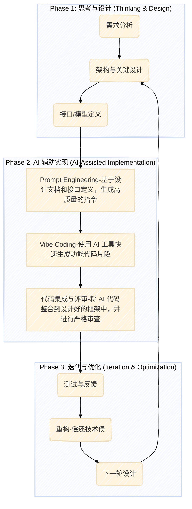

# 为什么 Vibe Coding 时代依旧需要“先设计后编码”

> 当代码的“氛围感”与工程的“严谨性”相遇，我们并非站在十字路口，而是迎来了一次重新审视软件工艺精神的契机。

### **Key Insights**

1.  **Vibe Coding 的本质：** Vibe Coding 是由 AI 驱动的编程新范式，开发者通过自然语言描述期望，由 AI 生成代码，核心是“氛围”和“感觉”驱动的快速原型实现。
2.  **效率革命的B面：** Vibe Coding 极大地提高了从想法到产品的转化速度，尤其适合实验性项目和早期原型验证，降低了编程门槛。 但它并非银弹，可能导致结构混乱和难以维护的“代码债”。
3.  **设计的价值回归：** “先设计后编码”并非指僵化的瀑布模型，而是强调在编码前进行系统性的思考与规划。 这种思想在敏捷时代演化为持续的、轻量化的设计实践。
4.  **设计的核心目标：** 设计的核心是管理复杂性。它通过建立清晰的蓝图，确保系统的可维护性、可扩展性和团队协作的高效性，从而在长期看节省成本、规避风险。
5.  **未来的融合之道：** Vibe Coding 与“先设计后编码”并非对立关系。未来的高效开发模式很可能是：以严谨的设计原则为指导，利用 Vibe Coding 的效率优势作为实现工具，实现“深思熟虑”与“快速迭代”的统一。

---

## 浪潮之巅：当 Vibe Coding 遇上工程理性

软件开发领域正经历一场深刻的范式转移。一个名为 **Vibe Coding**（氛围编程）的新概念，由著名计算机科学家 Andrej Karpathy 提出，正迅速席卷技术圈。 它的核心理念是：开发者不再逐行编写精确的语法，而是通过自然语言向 AI 描述需求和“感觉”（Vibe），AI 则负责生成和实现代码。 这听起来像科幻小说，但得益于强大的大型语言模型（LLM），它已成为一种新兴的现实。

Vibe Coding 推崇“先做出来，再打磨”（Code First, Refine Later）的理念，它将开发者的角色从“建筑工人”转变为“创意总监”。 这种模式极大地提升了原型开发和创新的速度，让不懂编程的人也能将想法变为现实，堪称一场效率革命。

然而，在这股“跟着感觉走”的浪潮中，一个古老而核心的软件工程原则——“先设计后编码”（Design Before Coding）——似乎显得有些“不合时宜”。当 AI 能够瞬间生成我们想要的一切时，我们还需要花费时间去绘制蓝图、规划结构吗？

答案是肯定的。而且，**比以往任何时候都更需要**。

这篇文章将深入探讨，为什么在 Vibe Coding 时代，"先设计后编码"的工程理性不仅没有过时，反而是驾驭 AI 强大力量、确保软件项目长期成功的压舱石。我们将从 Vibe Coding 的本质与局限出发，重新审视设计的核心价值，并最终探讨两者如何融合，塑造未来的软件开发新形态。

## Vibe Coding 的光环与阴影

Vibe Coding 的魅力是毋庸置疑的。它代表了一种更直观、更具创造性的开发方式，尤其在以下几个方面展现出巨大优势：

*   **极速原型验证：** 创业公司和产品团队可以以前所未有的速度构建最小可行产品（MVP），快速验证市场想法。
*   **降低技术门槛：** 设计师、产品经理等非传统开发者可以更直接地参与到创造过程中，实现技术的“民主化”。
*   **激发创意探索：** 开发者可以从繁琐的语法和重复性工作中解放出来，更专注于功能的创新和用户体验的打磨。

然而，当我们褪去 Vibe Coding 的光环，深入其工作流的内核时，会发现它并非没有代价。完全沉浸于 AI 助手的“氛围”中，将详细的实现过程外包给 AI，也可能将我们引向混乱的深渊。

### 技术债：Vibe Coding 时代的新“高利贷”

“技术债”（Technical Debt）是软件工程中的一个经典比喻，指为了短期速度而采取非最优解决方案，导致未来需要花费更多时间和精力来弥补的成本。 Vibe Coding 如果被滥用，极易催生大量且隐蔽的技术债。

*   **结构性缺失：** AI 生成的代码可能在功能上“看起来能用”，但缺乏长远的架构考虑。 模块之间可能高度耦合，数据流混乱，为后续的功能扩展和维护埋下巨大的隐患。
*   **一致性与规范的挑战：** 在没有明确设计指导的情况下，不同时间、针对不同需求生成的代码片段，其风格、模式和质量可能天差地别，导致整个代码库呈现出一种“缝合怪”的状态。
*   **“黑箱”代码的风险：** 开发者可能并不完全理解 AI 生成代码的底层逻辑。 这不仅使得调试和修复深层次问题变得异常困难，还可能引入难以察觉的安全漏洞。

正如 Ward Cunningham 最初提出技术债概念时所说：“第一次发布代码，就好比借了一笔钱。只要通过不断重写来偿还债务，小额负债可以加速开发。但久未偿还债务会引发危险。” Vibe Coding 的便捷性可能会诱使我们不断借债，而高昂的“利息”——即维护成本和系统崩溃的风险——将在未来某个节点集中爆发。

### 从“感觉”到“工程”的鸿沟

软件开发不仅仅是实现功能，更是一项系统工程。一个成功的软件项目，尤其是在大型、长周期、多人协作的场景下，需要满足远超“功能可用”的要求：

*   **可维护性 (Maintainability)：** 软件的生命周期中，绝大部分成本消耗在维护阶段。 代码是否易于理解、修改和扩展，直接决定了项目的长期生命力。
*   **可扩展性 (Scalability)：** 系统是否能应对用户量和数据量的增长？架构是否支持在不重构核心的情况下添加新功能？
*   **可靠性 (Reliability)：** 系统在各种边界条件和异常情况下是否依然能稳定运行？
*   **协作效率 (Collaboration Efficiency)：** 团队成员是否能基于一个共同的理解进行开发，而不是在混乱的代码中互相猜测意图？

Vibe Coding 本身并不直接关注这些工程属性。它的优化目标是“最快地实现描述的功能”，而非“构建一个健壮、可持续的系统”。当项目规模扩大、复杂度提升时，仅凭“氛围”驱动的开发模式将难以为继。

## “先设计后编码”：超越时代的软件工艺精神

很多人对“先设计后编码”的理解还停留在僵化的“瀑布模型”（Waterfall Model）——即花费数月时间编写详尽的设计文档，然后才开始编码。 然而，在现代软件开发语境下，尤其是敏捷开发（Agile Development）成为主流后，设计的内涵已经发生了深刻的演变。

现代软件设计不再是“一次性”的庞大工程，而是**一种贯穿项目始终的、持续性的思考与规划活动**。 它可以是轻量级的，比如一张白板上的架构草图、一份核心接口的定义，或是一个关键流程的状态机图。其本质是在动手（编码）之前，先动脑（思考）。

### 设计的核心价值：管理复杂性

软件工程的本质挑战在于控制复杂性。随着项目规模的扩大，代码的复杂性会呈指数级增长，最终导致开发效率急剧下降，甚至项目停滞。 而设计的首要目标，就是**主动地、系统性地管理这种复杂性**。

以下是“先设计后编码”在现代开发流程中的核心价值：

1.  **提供清晰的路线图 (Clear Roadmap)：**
    *   设计过程强迫我们思考系统的整体结构、模块划分以及它们之间的关系。 这就像在建造大楼前拥有了建筑蓝图，每个开发者都清楚自己的工作在全局中的位置。
    *   对于大型项目，架构设计尤其关键，它定义了系统的骨架，确保了可扩展性和可维护性。

2.  **早期识别与规避风险 (Early Issue Identification)：**
    *   在设计阶段，更容易发现潜在的逻辑冲突、性能瓶颈或安全漏洞。
    *   修改设计文档或图表的成本，远低于修改已经写好并集成的代码。 “在纸上犯错”永远比“在代码里犯错”更便宜。

3.  **促进团队沟通与协作 (Improved Communication)：**
    *   设计文档、图表和模型提供了一种通用的语言，让开发者、产品经理、测试工程师甚至客户都能在同一频道上交流。
    *   这减少了因理解偏差导致的需求误读和返工，是高效团队协作的基石。

4.  **奠定高质量代码的基础 (Foundation for Quality Code)：**
    *   良好的设计为编写高质量、高可维护性的代码提供了指导。例如，遵循 SOLID 原则的设计，能自然地引导出低耦合、高内聚的代码实现。
    *   这使得代码更容易进行单元测试，从而保障软件的整体质量。

---
```ad-tip SOLID 设计原则
SOLID 是由 Robert C. Martin 提出的面向对象设计的五个基本原则的首字母缩写，它们是编写可维护、可扩展软件的重要指导方针。
*   **S - 单一职责原则 (Single Responsibility Principle, SRP):** 一个类或模块应该有且只有一个引起它变化的原因。 这意味着一个类应该只负责一项功能。例如，一个处理用户数据的类不应该同时负责将数据渲染到界面上。
*   **O - 开放/封闭原则 (Open/Closed Principle, OCP):** 软件实体（类、模块、函数等）应该对扩展开放，对修改关闭。 这意味着当需要添加新功能时，我们应该通过扩展现有代码（如继承、实现接口）来实现，而不是直接修改已有代码。
*   **L - 里氏替换原则 (Liskov Substitution Principle, LSP):** 所有引用基类的地方必须能透明地使用其子类的对象。简单来说，子类应该可以替换掉它的父类，并且程序行为不会出错。
*   **I - 接口隔离原则 (Interface Segregation Principle, ISP):** 客户端不应该被强迫依赖它不使用的方法。这个原则主张将大的接口拆分成更小、更具体的接口，以便客户端只需要知道它们关心的方法。
*   **D - 依赖倒置原则 (Dependency Inversion Principle, DIP):** 高层模块不应该依赖低层模块，两者都应该依赖于抽象；抽象不应该依赖于细节，细节应该依赖于抽象。 这意味着我们应该面向接口编程，而不是面向实现编程。
```

---

### 设计与敏捷开发并非“死对头”

一个常见的误解是，敏捷开发等于“不需要设计，直接开干”。 实际上，敏捷方法论反对的是“过度前期设计”（Big Design Up Front, BDUF），而非设计本身。

在敏捷流程中，设计是**迭代式和演进式**的：

*   **初始架构设计：** 在项目启动时，团队会进行一个初始的、高层次的架构设计，勾勒出系统的轮廓，但这并非一成不变。
*   **迭代中的设计：** 在每个迭代（Sprint）开始前，团队会针对本次迭代需要开发的功能进行“恰如其分”（Just Enough）的设计。
*   **持续重构：** 随着开发的进行，团队会不断地重构代码，以优化和完善设计，使其适应需求的变化。 这正是对“设计债”的持续偿还。

敏捷开发中的设计，更像是在绘制一张不断精确化的地图，而不是一次性雕刻一座完美的雕像。

## 融合之道：让 Vibe 驱动实现，让设计引领方向

Vibe Coding 和“先设计后编码”并非零和博弈。将两者对立起来，是在制造一个错误的二分法。未来的软件开发，必然是两者的有机结合。**Vibe Coding 是强大的“引擎”，而设计则是确保方向正确的“罗盘与舵”**。

我们可以构建一个这样的未来开发流程：



### 实践指南：如何在 Vibe Coding 时代做设计

1.  **分清场景，按需设计：**
    *   **探索性项目/一次性脚本：** 对于这类项目，Vibe Coding 的优势可以被最大化。几乎不需要正式的设计，快速试错是关键。
    *   **中小型应用/MVP：** 进行核心业务逻辑和数据模型的轻量级设计。明确关键接口，然后利用 Vibe Coding 填充实现细节。
    *   **大型、长期、复杂系统：** 必须进行系统性的架构设计。 划分好模块边界、定义清晰的服务契约。设计文档是团队协作的“宪法”。然后，在各个模块的实现层面，可以引入 Vibe Coding 提升效率。

2.  **从“编码者”到“设计者与评审者”的角色转变：**
    *   开发者的核心价值不再是写出多少行代码，而是能否做出高质量的设计决策，以及能否精准地描述需求（Prompt Engineering）。
    *   另一个关键技能是**代码评审（Code Review）**。对 AI 生成的代码进行严格的审查、测试和重构，是确保工程质量的最后一道，也是最重要的一道防线。

3.  **将设计原则融入 Prompt：**
    *   在向 AI 提出需求时，不仅仅是描述“做什么”，更要包含“如何做”的约束。
    *   例如，可以在 Prompt 中明确要求 AI “遵循单一职责原则”、“使用工厂模式”或“为这段逻辑生成单元测试”。这将 AI 从一个随性的创作者，变为一个遵循工程规范的助手。

## 结论：拥抱 AI，但更要坚守工程之魂

Vibe Coding 带来的变革是令人兴奋的。它将软件开发的生产力推向了新的高度。然而，工具的进步不应让我们忘记构建优秀软件的根本原则。正如再先进的电钻和切割机，也无法取代建筑师对结构力学和空间美学的深刻理解。

“先设计后编码”所代表的，不是繁琐的文档和僵化的流程，而是一种**对问题进行深度思考、对复杂性进行系统性拆解、对长期价值负责的专业精神**。这正是软件开发从“手工作坊”走向“现代工程”的基石。

在 Vibe Coding 时代，我们的角色正在演变。我们不再是代码的“打字员”，而是系统的“架构师”、AI 的“指挥官”和质量的“守护者”。在这个新角色中，“先设计后编码”的思维模式是我们手中最有力的工具。它让我们能够驾驭 AI 的澎湃动力，而不是被其随波逐流，最终构建出不仅能“运行”，更能“长存”的伟大软件。