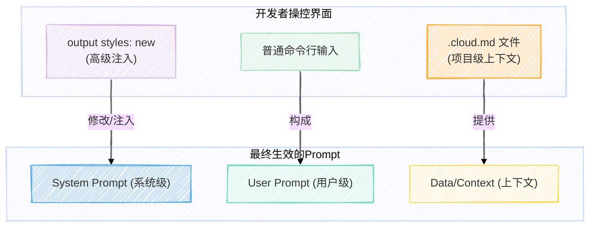

好的，作为“Vibe Genius”社区的内容主理人，我将基于这份信息量巨大的闭门交流录音，为您呈现一篇专业、深度且兼具可读性的万字纪实。

# 【AI Agent Teaming: 当MBTI人格注入Cloud Code】

> AI 从业者内部的讨论，总是充斥着各种黑话与洞见。在 Vibe Genius 最新一次的闭门分享中，我们深入探讨了 AI Agent 的前沿玩法：将 MBTI 人格注入 `cloud code`，构建拟人化的 AI Agent 团队。这不仅是技术上的奇思妙想，更可能预示着下一代开发范式的到来。

### **Key Insights**

*   **Agent Teaming 崭露头角:** 告别单一的 Copilot 模式，通过为 AI Agent 赋予不同的 MBTI 人格，可以组建一支具备多样化技能与视角的虚拟团队，以应对更复杂的任务。
*   **`output style` 的本质是 Prompt 注入:** `cloud code` 的 `output style` 功能，其本质是一种高级的 `system prompt` 注入机制。它为开发者提供了一个“HACK”大模型的窗口，允许在系统层面重塑 AI 的行为范式。
*   **KVC 优化是自部署的关键:** 在自部署大模型时，高度重复的提示词（如人格设定）会通过 KVC (Key-Value Cache) 机制被优化。这意味着，为 Agent 设定固定“人设”不仅在应用层有效，在模型推理层面也更具经济性。
*   **重新审视“命令行”:** 随着 `cloud code` 等工具的涌现，Terminal 正在从一个简单的命令执行环境，演变为一个可承载复杂 AI 工作流、甚至实现“全民 hacking”的核心交互界面。
*   **协作的终极挑战——状态同步:** 当多个 AI Agent 或多个用户协同工作时，最大的技术挑战并非任务分配，而是对共享资源（如代码文件）的状态管理与锁机制，这决定了协作的效率与稳定性。

## `cloud code` 新范式：从工具到“赛博格”

**南川 Mark**: 好，我们就现在开始了。本来是我和魏阳想 1v1 聊聊他群里发的那个 MBTI 的东西，我觉得挺有意思。但后来想，既然要分享屏幕，不如直接开个会议，喊大家一起聊聊。没想到来了这么多人，也很意外。我先把魏阳发的那个 MBT (MBTI) 和 `cloud code` 发在群里给大家看一下，这挺有意思的，因为它正好是我们这几天在聊 `cloud code` 的一个非常重要的点：`output style`。这个东西目前可能了解的人不是特别多，但是也有一些人已经用的比较熟了。

**Weiyang**: 一开始说好是 1v1，怎么突然就变成“游街示众”了。我先自我介绍一下吧。我刚参加工作的前几年是搞关系型数据库和机器学习，后来在一个偏研究性质的研究组做深度学习，主要是计算机视觉和上一代的 NLP。那时候还是 BERT 出来之前，`word to bike` (word2vec) 后面那一代。我记得 `word2vec` 是 13 年年底开源的，BERT 是 18 年底开源的。在这中间的时间点，我主要在做深度学习相关的工作。

19 年到 22 年，我自己运营了一个 AI 云。因为当时对 AI 领域的变现能力有判断，觉得它会远远超过其他应用，所以相当于抄底了显卡，做了个 AI 云。后来因为挖矿又火了，就把它卖了，搞了第一桶金，然后投了一些 AI 相关的项目。23 年到 25 年，我涉猎了 AI 音乐、语音社区、变声器和 TTS 等项目。去年底从一个 TTS 项目退出了，所以对语音这块还比较熟。

最近我发现 `code` 生态发展的很快。我把它看作一个工具，这家公司和它的老板也很有意思，经常会搞一些乐子出来，feature 提得很快。比如美国时间周四、周五晚上他们刚提出一个 feature，外界马上就开始解读。所以我也花了大概 10% 到 15% 的闲暇时间来研究这些东西。

**南川 Mark**: 我插个问题，最近那个叫“爸”的兄弟，他扒了一下 `cloud code` 最新出的 `output style` 功能，好像是 `code` 里面某一个人上任之后，闪现了这个 idea 然后就把它推出来了。所以我大胆猜测，这个团队内所有人都可以自由地去想这个命令行工具能发展成什么样，有什么好玩的功能都可以尝试往里加。如果功能确实有普适性，就会被合并，然后对外发布。我感觉是这样一种氛围。

**Weiyang**: 对，他说他好像是做教育的。我觉得咱们可以深入聊聊，我先给大家看一下我最近在搞的东西。

我最近比较喜欢用 warp 这个 terminal，它是一个开源的工具，我估计后面会收费，但目前用着还比较顺手，全平台应该都可以。

***

### **知识点：新一代开发工具**

*   **Cloud Code:** 由 Anthropic 公司开发的一款在命令行中与 AI 交互的工具。它允许开发者在终端（Terminal）中直接与 Claude 系列模型对话，进行代码编写、调试、分析等工作。其核心特点是深度整合命令行环境，并通过 `output style` 等机制提供了丰富的自定义和扩展能力。
*   **Warp:** 一款基于 Rust 开发的现代化终端模拟器，旨在提升命令行的用户体验。它内置了 AI 功能、团队协作以及类似 IDE 的输入框，与传统终端相比，交互更友好，功能更强大。
*   **MBTI (Myers-Briggs Type Indicator):** 一种人格类型理论模型，将人的性格分为 16 种类型。在本次讨论中，它被用作一种创新的方法，为 AI Agent 设定具体、多样化的人格特质，从而指导其行为模式和沟通风格。

***

**Weiyang**: 我们在开始 MBTI 之前，先说一个你上次提到的 CRI 的用法。我思考了很久，觉得 warp term 是可以满足你的需求的，并且在某种程度上可以替代 VS Code。你可以用它自由地组织信息，比如左边读代码、右边写笔记，同时还能调试网页。

**南川 Mark**: 那它能像 tmux 一样，关闭之后还能 `reload` 恢复会话吗？

**Weiyang**: 我感觉在 warp 这个环境里面，上下文是互通的。如果你启动了 `cloud code`，那在这个窗口里的所有操作都能共享上下文。

**南川 Mark**: cool，被你安利了。

**Weiyang**: 对，但你可以用它做一些事情，比如 `cloud code --resume`。它的 `resume` 组织得不够好，所以我需要一个组织能力更强的工具。你上次说你用 CUI (命令行界面) 用得很清晰，划分得很好。对我来说，VS Code 就已经不够优雅了，所以我一直在找新的工具。

## 核心洞见：MBT Command 与 AI Agent 团队化

**Weiyang**: 好了，言归正传，我们来聊聊 MBTI 这个项目。我做了几个功能。一开始接触的时候，就像你说的 `ultra sync`，这是它在模型训练时的一个指令，大模型读到 `ultra sync` 就会知道。然后我把这个指令进一步抽象成了一个 `SHORTC`，也就是 `command` 方案，这其实是对 user prompt 的一层封装。

我自己的性格其实不太适合做营销和运营这类工作，所以我在想，应该找一些不一样性格的人来组队。但后来觉得找真人组队其实也没太大必要，我可以把 MBT 都做成 `commands` 来组队。这就引出了项目里 `agent` 的功能。

`agent` 的功能比较拟人化。当机器读到某个 `agent` 的性格时，它就会模仿这个性格。比如说，在学习和分析项目时，你找一个 ITP (可能是指 INTP) 来干就很好。如果你想忠实稳定地执行一个 `to-do list`，不希望它中途乱发挥，只围绕现有例子来做，那么找一个 INTG 或者是 ISTG 去实现是合适的。它甚至不会给你节外生枝或者 jump out of the box。

但有的时候，如果你一个 bug 调不好，你不能让它永远围绕着你的 `to-do list` 去打转，你应该让它跳出现有框架，去思考一些更新颖的方式。这时候，一个偏向于 P (Perceiving) 的人格，就能够比较好地完成这个 debug 工作。这个想法是我上个月开始摸索的，参加了 seminar 之后，发现大家的玩法都很新，所以我就模仿了 `B mad` 的项目，做了个 `B mad method`。

它整个项目就是一套提示词。无论是 2D 游戏、3D 游戏还是 DevOps，都有不同的提示词和 `space`。我就在想，人类这么多行业，难道每次都要为新行业生成一套新的提示词吗？比如我做金融垂类，就要用金融的提示词；做法律垂类，就要用法律的提示词。这种方式的复用性非常差。

那什么东西的复用性比较强呢？**就是让正确的人去干正确的事。** 让搞运营的人去搞运营，让搞情绪价值的人去搞情绪价值，让搞架构的去搞架构。这样做有一个好处，就像我上次在 seminar 提到的，如果你是自部署，你可能会注意到 KVC (Key-Value Cache)。当你用一些高度重复的提示词时，它会在 `kv cache` 里被优化，自动帮你排序。也就是说，你在做任何工作时，比如我让 MBTI 这个拟人化的 `agent` 去执行，这 16 种人格适合做各种各样的工作。或者说，你做一个工作，可以组一个五人小队一起去做。

这其实是在服务端高度复用的，相当于给服务器省钱了。你自己部署会很开心，你用大厂的服务器，大厂也很开心。所以，我一开始想到的就不是“合适的工作”，而是“合适的人”。很快我就发现，在同一个 `request` 里面，是可能出现两个不同岗位来帮你干一件事的。比如，“帮我找到这个 bug，然后再忠实地执行，帮我修复它”。这两句话，看上去是同一个人的工作，但如果你用一种新颖的方式去找 bug，让大模型跳出常规思维，思考完了之后你才发现问题的真正所在。然后你把这个问题写在某个角落，比如 `.md` 文件里，下次执行同类任务时，你就可以用那个 `.md` 来约束后面帮你干活的 `agent` 的行为。这个 `agent` 可能和发现问题的 `agent` 不是同一类，但你实际上是把它的能力给充分发挥出来了。你就一定要让 agents 去组队，这就演变成了“组个小队”这个想法。

在以前军队的定义里，一个小队是 8 到 12 个人。但现在比如在美国，对小队的定义就是“好哥们”，大概三到五个人。所以我对小队的定义也是三到五个人，让三到五个不同的人去解决一个问题。在处理自己那部分任务时，因为是串行和异步阻塞的，你也不用担心几个 `agent` 同时写代码把你的项目搞坏。

**南川 Mark**: 我有两个小问题。第一个，您这个 16 个 MPT (MBTI) 是怎么写的？是 AI 帮你写的吗？

**Weiyang**: AI 给我写的。这里要提一下，对于写作的多样性和丰富的比喻，我最喜欢的是 KIMI。所以每次在初始化这个东西的时候，我先让 KIMI 给我写一套 16 篇乘以 1000 字的描述，然后把这 16000 字直接让 `cloud code` 再“洗”一遍。因为当你执行 `output styles: new` 或者 `agents` 命令时，我一般不会去想“我该怎么用这个工具”，而是会想“这个工具支持什么样的功能，能写出什么样的代码来实现这个功能”。

实际上，`agents` 这个命令本身，以及 `out to styles: new` 这个命令，它们本身就是一套“原提示词” (meta-prompt)。不管你写什么，最后输出的格式和规范，一定是大模型能看懂的那套 `spec`。这相当于我的 key，我这边有个 `.md` 文件，每一行开头都写好了，你甚至可以把它视为一个 JSON，里面的 key 都定义好了，比如 `output styles` 该用什么 `style`，不该用什么，例子是什么。

这些东西你如果随便写，也无所谓，因为 `output style` 本身就是 hack。但实际上，大厂的模型是接受规范化输入的，比如 `prompt 101` 就是有规范的。你随便写的提示词作为 `user prompt`，是发挥不出最大优势的，执行起来可能前言不搭后语。但如果你用了这套原提示词，就相当于把你不规范的提示词，“洗”成了它规范的提示词，遵循了它的 `prompt` 规范。所以我就不怕把我那个 KIMI K (KIMI K二) 输出的东西直接用。

这 16 种 MBTI 人格，它适合做什么，不适合做什么，最能够接受什么样的沟通方式，最不能够接受什么样的沟通方式，我都让 KIMI 写了一遍。KIMI 给了我一个方案，然后我再通知 `output style`，告诉它：“你根据我上面的描述，想象一下这种 MBTI 的人，最能接受和理解什么样的沟通方式。” 就是你不要一开口就踩到别人的雷点。

**南川 Mark**: 我大概理解了，这方式非常棒！你先有一个统一的压缩器，让 KIMI 生成 16 篇各 1000 字的文章，因为是同一个模型一次性生成的，所以这 16 个角色的内在一致性非常高。然后你再让 `cloud` 基于这个去做后续处理。

**Weiyang**: 对。我让 KIMI 写完一套之后，结合网上对这个 MPTI (MBTI) 的分析，包括其优势和劣势，来明确地告诉我。我觉得这套东西现在有 70% 的时间是有效的，跟正常人沟通都会变好。然后我直接告诉 `output style`：“这一段 1000 字的文本，就是对他人格的描述。你来跟我说一下，跟这种性格的人沟通，第一句话你不要踩到雷点，要顺着他说，让他觉得你的态度和说话方式特别可接受。” 只有当别人觉得你的态度可接受时，他才会静下来试着去理解你说的内容。

理解了内容之后，他还要去执行。所以你还需要一些方法来引导他执行。这个目标是谁？就是坐在屏幕前的各位。在 `agents` 文件夹里，这个 MBTI 可以让你假装有 16 个不同的人格帮你组成一个工作小队。如果你是一个性格非常强烈的人，那这套 `output styles` 里面就有一种特别适合你的风格，因为它知道哪句话是屏幕前的你最爱听的。接下来说的内容 `reasonable`，说完之后你很有动力继续干下去，执行你的项目。

**南川 Mark**: 情绪价值拉满。

**Weiyang**: 所以，今天的 `output style`，我觉得从技术上来说是 `hack system.Prompt`。在玩法上，我已经看到很多人在玩了。比如有人用 `agents`，也就是 `output styles`，通过 `bash` 去执行 `gemini -p`，然后在那边做 `code review`。我说，如果你能通过 `bash` 做 GP 的事，那你同样也可以通过 `hook` 或者 `bash` 去执行其他外部的 `deep research`，这都是有价值的。`cloud code` 之前就已经做了很好的 `tool use`，你只是通过 `output styles` 能够更好地把这些东西用起来。

***

### **知识点：提示词工程的三个层次**

在与大模型交互时，我们可以将提示词（Prompt）理解为三个不同的层次。Weiyang 和来新璐的讨论揭示了 `cloud code` 如何通过其设计，让开发者能够在这三个层次上进行操作，实现对 AI 行为的精细控制。

1.  **System Prompt (系统级提示词):** 这是最底层的指令，通常由模型提供方设定，用来定义 AI 的基本角色、能力边界和安全约束。普通用户一般无法直接修改。`cloud code` 的 `output styles` 功能，本质上提供了一种“hack”或注入 `system prompt` 的能力，允许开发者在系统层面改变 AI 的核心行为模式。
2.  **User Prompt (用户级提示词):** 这是用户在每次交互时输入的具体指令，例如“帮我写一个快速排序算法”。`cloud code` 中的大部分直接输入都属于这个层次。
3.  **Data/Context (数据与上下文):** 这包括了对话历史、当前打开的文件、`.cloud.md` 文件中的内容等。这些信息为 AI 提供了执行任务所需的具体背景和知识，是保证输出相关性和准确性的关键。

通过 `output styles` 修改 `system prompt`，通过命令行输入提供 `user prompt`，再结合 `.cloud.md` 管理 `context`，开发者就拥有了全方位的 AI 控制能力。

***

**南川 Mark**: 我的第二个问题是，你 `commands` 上面不是有个 `score` 吗？它是在什么场合下被调用的？

**Weiyang**: 在我着手 `refactor` 一个大项目，或者开始一个新项目之前，我会用 `score`。它会从我定义的 16 个 MBT 里面选一个出来，帮我做规划。但它做的不是 `spec` 的规划，而是分角色的规划，告诉我们“谁应该做什么”。它认为每个子任务都适合一个或多个角色去干。

所以 `squad` 这个功能，是我在弄完 `sub agent` 之后的第一反应。当你要开始一个中型项目，比如修复一个上千行代码的网页，这个功能就非常适合。

**南川 Mark**: 那您这个 `score` 到时候方便分享给大家吗？还是说会开源？

**Weiyang**: 开源了，都已经是开源的。整个 MBTI 也是开源的。

## `cloud code` 的 Hacking 哲学与社区生态

**Weiyang**: 我觉得 `cloud code` 在很多地方考虑到了人性的“乐子”那一部分。比如之前有人花了 5 万刀，这里面就有娱乐的成分。所以我的项目里也有个 `status line`，刚出来的时候大家可以看到右下角，它会统计你每天、每周、每月花了多少钱，你在哪个位置，用了什么模型，`context` 有多大。我觉得这满足了 `cc user` 一些占便宜和炫耀的心理。

我还看了 `whisper.cpp` 这个项目，大概 4 万多 star。我还没接好，一些编译工作感觉挺难的，或者接出来不方便开源，因为它太重了。但是我把很轻量的，从外部接的 MINI TTS 接口也放在了这个项目里面。

**南川 Mark**: `ASR` 和 `TTS` 我们可以晚点私聊，我们最近也做了一个相关的项目。我现在想看的是你那个 `B mad`，你用过吗？

**Weiyang**: `Dota Ok`。我刚才说了，我启动并开始写 `BMBTI` 的第一行时就在用它。但它就是提示词，大家都是。

**南川 Mark**: 所以你现在觉得用你的 `score` 配合你的 `style` 会更爽？

**Weiyang**: `cloud code` 面前人人平等，你能做的我也能做。我要把我的东西复用起来，它是围绕项目和项目类型来做的，比如 2d/3d 游戏他们都有。我用我自己的，但如果用 B 麦克（B mad）也挺爽，他把如果你是搞运维或者 2d/3d 游戏的，直接用那个也行。他理解的项目流程和拆分，和你理解的基本上是一致的。而我做的这个东西，我希望它更通用一点，不管你是 2d 游戏还是 3d 游戏，前面接一个 `deep research`，后面接一个 `S`，就可以分工。

**南川 Mark**: 你可以给大家简单演示一下吗？比如在 `output` 里面再新建一个 `style`。

**来新璐**: 我想问一下，`output style` 这个特性，我看网上有两种用法。一种是写一个非常长的文件，像替换系统提示词一样。另一种就像你现在这样，用非常简短的指令。它实际的工作机制，到底是把整个 `cloud` 的系统提示词给换掉了，还是拼接进去？

**Weiyang**: 它的技术本质是 `packing case prompt`。我认为它自己的 `state` 前一段仍然是它内部默认的一段。只不过 `hacking from` 是我新写的这一段，我创立了这一段。

**来新璐**: 那它其实跟 `.cloud.md` 文件的作用方式差不多？

**Weiyang**: 有一个区别，就是复用的程度。`sub agents` 或者 `CLOUD MD` 被复用的程度需要更高。如果你是一个 MBTI 性格的人，你就可以把它切成你那个 MBTI 的 `style`。比如，我切到 `learning` 模式，它就一直是 `learning` 模式。你此时此刻需要一直在学这个新项目。它切到 INTG 模式，也是因为它在揣摩 INTJ 喜欢听什么，才会给你讲什么。所以它每次请求都会带着这个 `style`。但如果你把 `style` 放在这里，它明显就不是每次请求都会带，甚至简单的任务根本就不会带。

**南川 F Mark**: 我稍微补充一下。我们整个 `cloud` 的 `code` 系统里面，上下文分好几个部分。第一个是系统的 `prompt`，我们看不到，但来新路之前做过逆向，知道它存在。第二个是我们所谓的 `.cloud.md`，分好几个文件，在项目根目录和用户根目录。第三个才是用户的上下文 `prompt`。所以它分了三个层级。官网说 `output style` 改的是原先 `system prompt` 里面的某一部分。

**Weiyang**: 它不是完全替换，`CC` 整体还是面向 `coding` 的，但它允许你在这里面“注入”。它跟调用外部工具没啥关系。`styles` 里面默认就有 `default a complete coding task`，`explain implementation choices` 和 `learning`，这明显都是 `human readability`。它之所以允许你做 `hiking`，就是为了让你做 `human readability`。如果它在乎的只是 `machine readability` 或 `lm readability`，它根本不会开放这个注入 `system` 的权限。它既然敢开放，就说明有些地方它也认为你改不了。而且 `new` 这一块它已经拦下来了，像大厂一样，认为最安全的方式就是把越狱风险高、不安全的请求都拦下来，只把安全的东西写到 `output` 文件里。

## 语音交互：下一块前沿阵地

**南川 Mark**: 我感觉你们最近好像都在用语音写代码，实际效果怎么样？比如识别率，甚至情绪的识别，都能达到实际编码的预期吗？

**Weiyang**: 我没有用语音输入，我是用语音播报输入。有的时候一个项目如果没想好，我脑子会卡，就不太好。所以有时候就是慢慢写提示词，或者写 `to do`、`plan`，然后让结果 TTS 播报出来。`post tool use` 也会对每次调完一个库或 `to do` 之后，围绕这次的输出给我一个 `summary`。

**南川 Mark**: 你这个语音速度肯定跟不上你打字的速度。

**Weiyang**: 还好，因为 `tool use` 之间间隔很长。在摸鱼场景下，我没那么集中时就会把语音打开。如果我很集中，我一定是静音的，但静音我也让它一直播。

**南川 Mark**: 输入我觉得是有必要的。像 Mac 的听写能在 `CC` 里用吗？我用不了。

**Weiqi (AR+AI软硬件)**: `output` 一定要有 `display`，因为信息的带宽会大很多。`input` 的话，用语音你会带情绪，我平时用 ChatGPT 也是用语音输入，你会发现在讲解过程中会把自己思路理得很清，而且会补充一些文字打不出来的细节。但 `output` 的话，一图顶千言，没办法。

**Weiyang**: 我最近发现一个也挺重的项目，叫 `whisper input next`。是小红书的一个网友做的二改，串的有点小问题，但我能改。他把 `gpt-4o` 做了优化，比如我语音说了一长段没想清楚的话，它能帮你美化，把前言不搭后语或者没有结构的东西补全。

**来新璐**: 预告一下这个软件，我上次在比赛上做了一个，已经开源了，但是快捷键老是时灵时不灵的。当时我们有个比赛，我说我 `CC` 这么牛逼，要试一下原生开发，用 `CC` 写 Swift。结果发现一大堆问题，不知道是模型没训好原生语言，还是怎么回事，反正不管是监听快捷键还是回写到光标，都有一堆问题。但勉强通了，就是你巴拉巴拉讲完，它调用一个 `mini` 的小模型帮你转写一下。

***

### **知识点：语音 AI 的现状与前沿**

对话中深入探讨了语音作为下一代人机交互接口的潜力和挑战，提及了多种模型和技术，展现了从简单的“语音转文字”到包含“情绪理解”的复杂交互的演进。

| 技术方向 | 核心概念 | 讨论中提及的方案/模型 | 特点与挑战 |
| :--- | :--- | :--- | :--- |
| **ASR** | **Automatic Speech Recognition** (自动语音识别) | `Whisper`, `Whisper.cpp`, `SenseVoice` (阿里), `GLM` (智谱), `MINI CPM` (面壁) | **核心挑战**: 缺乏上下文、热词和知识库，导致准确率瓶颈（停留在70-90%）。端到端大模型方案虽好，但成本高。免费方案如 Whisper 没有上下文能力。 |
| **TTS** | **Text-to-Speech** (文本转语音) | `Mini TTS`, `sweet girl2` (自定义语音) | **应用场景**: 摸鱼、听 `summary`、辅助阅读。**核心价值**: 降低信息速率，适合非专注场景。定制化语音（如 `sweet girl2`）可以提升体验。 |
| **SER** | **Speech Emotion Recognition** (语音情感识别) | `SenseVoice` (阿里) | **核心价值**: 将“情绪”作为一种信息维度传递给 AI，让 AI 的回应更具感知力、更贴合用户意图。这是从“能听懂”到“会共情”的关键一步。 |
| **流式输入** | **Streaming Audio Input** | `GPT-4` (更贵), `GRM-4-voice`, `7月星辰` (面壁) | **技术优势**: 支持音频流直接输入，相比先录音再转写的模式，延迟更低，交互更自然。是实现真正对话式 AI 的基础。 |

**结论**: 当前语音交互的瓶颈在于如何低成本、高效率地让 AI 理解语音中的**上下文**和**情绪**。阿里的 `SenseVoice` 等模型已经开始探索情绪识别，而流式输入技术则为更流畅的对话体验铺平了道路。未来，语音将不仅仅是输入的替代方案，而是一种包含更丰富信息（情绪、语气、环境）的全新交互带宽。

***

**来新璐**: 国内其实也有一些方案，像阿里的 `SenseVoice` 是可以识别情绪的。GLM 我上次跟他们算法负责人交流，他们 GRM-4 有一个 `voice` 版本。面壁智能也开了一个小模型叫 MINI CPM。这几个都是支持音频流输入的。但是我没有换到他们上面去测，感觉国内这几个模型可能在工程级成熟度上还不够。

**Weiyang**: 传统的 ASR，几十兆到一百兆的模型，因为它缺乏上下文、热词和知识库，导致准确率就停在 70-90% 上不去。但如果你想引入大模型的能力，比如 3B、5B、10B 的端到端模型，你又会觉得不划算。所以像 `go` 和 `S` 的 `whisper` 都是不要钱的，因为它没有上下文辅助。

**南川 Mark**: 我一直想问，现在的 `SR` (Speech Recognition) 可以同时转写文字并输出你当时的情绪吗？我觉得情绪很重要，可以把它作为 prompt 的一部分。

**来新璐**: 有的，阿里的 `SenseVoice` 可以。

**南川 Mark**: 对我刚才想了一个比较好的场景。大模型回复的结果不符合预期时，如果我们是语音交互，就可以直接脱口而出：“你怎么能这么回？” 但如果我们是打字，当你准备打字时，可能情绪已经平静下来了，就只能打出“对”。

**Weiqi (AR+AI软硬件)**: 这就是效率之一。语音的 `input` 带宽比文字高，但 `output` 却比文字低十倍以上。这就是为什么我们需要在眼镜上做 `display` 的原因。你要从碳基生物本身去想，他的思维核心就是这样，在讲述一件事情的时候，真正能把事情讲清楚的人有多少？其实很少。你都是在不停输出的过程中去整理自己的逻辑。打字不一样，打字是一直在思考，你可以把第三行直接贴到第一行去调整，这是一个结构化的语言。

## 社区激辩：AI 工具的演化、商业与哲学

**Weiyang**: `cursor` 其实每天都在亏钱，因为他们毛利率是负的，所以是 80 分的产品跟 100 分的比。我那天看了 `Cer` 上那个 `GPT` 五，它分什么 `slow fast`、`high medium low`。`augment` 就只上了两个，一个是 `sonnet 41` 一个是 GPT 五。`CC` 也是只上了两个模型。`cursor` 打开就是几十个模型。我说白了，就 GPT 和 `cursor` 这两家公司加在一起，都凑不出来一个完整的产品经理。脑子不怎么长，能做产品吗？

**来新璐**: `cos er` (cursor) 的产品负责人其实挺优秀的，他之前是 Notion 的，现在好像去了 `cos`。

**Weiyang**: 我觉得从五六月份的时候，`coser` 就已经明显地在加新 `feature` 上对市场不敏感了。很多东西都是现抄的，抄完之后他自己都不知道为什么要抄。

**南川 Mark**: 你这个点很有意思。前两天我们正好也让 Jim 给我做了一份调研，结果就是他们还是以“安全”为第一出发点，把整个安全的事情做得特别好。在此基础之上，又开始做一些创新。所以从长期来看，有点像“强迫后学”，它的壁垒可能会越来越高。

**Weiyang**: 我看了你说的。

**南川 Mark**: 对，你看他现在已经改了，给用户开放了特别多的权限和功能。从 `system` 级别到普通的 `pro` 级别，从被动的 `MCP` 到主动的 `slash command`，几乎所有能想到的玩法，你都能在一个 terminal 里玩遍，甚至连动画特效都加上了。你觉得他接下来还会怎样？

**Weiyang**: 动画特效，我看到什么高光闪过、什么金属质感，我靠我都惊呆了。如果你想百分之百实现这里面的乐子，你必须像心路一样写一个东西才能获得这种抽象的快乐，但这太大了。

**来新璐**: 其实 `close` (cloud code) 的设计真的非常简单，没有大家想的那么复杂。这也是为什么它的每个模块都能愿意定期加一个小功能开放出来让你替换，因为它真的就没几个模块。

**南川 Mark**: 因为整个 `code` 是一个叫“历史”这样一种轻量级的架构，所以它能够结构得特别好。

**Weiyang**: 就是你拿着这个十兆的混淆过的东西，还要关心上一个版本和这个版本的 `diff`。你要读 200 次，把十兆的东西拆成 100 个 100K 的 `charts`，差不多是 25K tokens，刚好是大模型输入输出比较舒服的范围。你要把前后两个版本 200 份 25k token 的量塞进去，先分析 200 次，然后再 `diff`，`diff` 完了之后再把好玩的乐子找出来。这个东西如果不是能够凑齐一批“乐子人”定期在这更新的话，我觉得反正是有点望而生畏。

## 终极议题：多 Agent /多用户协作的未来

**来新璐**: 我觉得川哥是这样，你的朋友圈基本上都是另一群高强度使用 CC 的人。我在想，其实我在小红书上偶尔会刷到一些用法，但他们分享的都不太详细。就是有些人会多个摊上开多个 CC，然后让他们通过一些文件的方式来进行协作，来加速整个聊天效率。那这些用多 CC 的人，他们是怎么在一个项目中去实现良好的不同协作关系的？这会是下一步一个蛮重点的东西。

**南川 Mark**: 只要它不涉及到单独写就没啥问题。

**来新璐**: 怕是有一个同步和互斥性，不是所有的任务都那么好并行。

**南川 Mark**: 不是的。你整个执行任务的过程中，它是一个阻塞进程。因为它要 `thinking`，在传统的软件 CPU 里面是没有这一步的，现在 `thinking` 成为了比 IO 更大的一个阻塞。所以在这个 `block` 这么长的情况下，大部分时候是不会出现单独写的。偶尔会出现，是因为现在 `CCU` 比较强，它在你读过一遍之后，发现文件又被别的东西改过了，它会进入一个 `draft` 状态，需要重新再读一遍。所以现在 `CC` 已经这么智能了，多个 `CC` 在操作同一个文件夹会互相打架，但问题不大，因为发生概率第一比较低，第二智商够。

**Weiyang**: 我提供一个可能的方案。我从 5 月份开始到至少 7 月底，都在弄偏前端的东西。我发现一个问题，`responsive`、`i18n` 和一些别的东西，你做起来是正交的。就比如说我要认真改 `s8n`，我就围绕 `component` 在改，或者围绕页面来改。我要去做 `responsive`，那些 `css in js` 的东西我就单独去改。就是有的东西在你改的过程中，你会发现它们是完全没有任何关系的，那这个是可以并发的。

但完全正交的东西，你同时改是非常困难的。你有十个页面，每个页面上面都有 12345 的 `responsive` 行为，那你同时修改。这两个东西，你要精确到行才能解耦。这在体感上是困难的。如果你第一个任务已经 `apply diff` 了，相当于在某个行里面插了新的东西，那你希望改的正交的另外一个功能，它的行号全都变了。这个时候你同时做就不太安全。

几个 `motivation`，在竞争协作的过程中就相当于，我这个页面要简洁美观，又要有功能性能，那可能就留下五个 `top` 的功能。但是现在上来三个 `agent`，每个 `agent` 心目中最重要的功能套餐都不一样，那你们三个必须先讨论好，达成一个相对的一致，才能往下做。

**南川 Mark**: 但确实可以加一个 `content state lock`。其实在工程上，甚至我们作为第三方都可以实现。比如在你的 `output style` 里面约定，当你要读文件的时候，先去 `check` 一个我们所谓的“表”，其实就是一个缓存队列。

**Weiyang**: 我举个最简单的例子，这跟产品定位相关。你用推特的手机版或者微博的手机版，也会用微信、小红书。为什么这些产品的第一屏不一样？你下面大概会有五个功能，最左边的一定是最重要的功能。为什么大家最左边的功能不一样？那你几个人就要抢这个位置，你们三个先打一架，打完了 `state` 相对稳定了，才能开始做。真正的危险就在这，大家都觉得 `agent` 来了，认为在我的视角里，通讯录应该排第一位，他把通讯录调过去了。过了两天，一个不认识的 `agent` 过来，说不对，微信聊天应该在第一屏。所以这是属于需要竞争，竞争到一定阶段，才能把它定下来的。

**来新璐**: 对我来说，最关键的就是好像需要一个 `team` 的 `mentor` 或者 `leader` 一样。一个研发小组，你要让不同的员工，比如好几个前端、好几个后端协作，可能你们在一个 `git` 仓库上工作。我觉得今天 `CC` 就是你直接跟 `CC`、跟这个 `team` 打交道，这种开发方式挺像的。

**Weiyang**: 上次谁跟我说，不同 `agent` 的权重没法设置，我觉得他说得很对。权重是现在你让大模型去负担 `random number generator` 的东西，它做不好。所以这个东西你就应该写在 `code` 里面，设计权重。你一个小组有五个 `sub agent`，但完成这个工作，你有你的 `final belief`。你一个真人作为宏观掌控者，有你的 `final belief`，就是到最后这个东西你为什么做，你想帮助哪些人，想让哪些人用得爽、用得有价值。这些都是你从设计之初就有的 `final belief`。在这个框架之下，这些 `agents` 才能去竞争有限的资源——屏幕底部就五个按钮，哪个排第一，哪些该出现，哪些不该出现。这就是在有约束的条件下把活干了。

## 尾声：走向“AI原住民”的思考

**Weiqi (AR+AI软硬件)**: 我觉得未来员工就是你不用把他看作是机器还是人，你模糊他，反正就是工具，也是牛马。一只是它到底是碳基工具还是硅基工具，最后只会用更高效、更便宜的。短期内，TO B 是个好的主题，但它现在已经泛化了，不像原来那样了。

**Weiyang**: 很多工具所谓的做 TO C，你 C 都已经足够 `pro` 了，你拿它来“娱生”，回头搞个一人公司也无所谓的。

**Weiqi (AR+AI软硬件)**: 最终还是要第一性原理，你核心还是要输出价值让人买单。

**Weiyang**: 所以我感觉，做工具为什么我就点题了，`call back` 了一下。AI 发展这么快，我的第一个反应就是，当我融入的时候，我要叛变，我要叛逃。我跟人的信任就没那么高了，你别说你什么专家，我能问我大模型。人和人的沟通，信任先降低。我再把人和人的沟通或者信任感提高上去，从沟通技巧，到采购营销服务客户对接这些东西，我总有办法能够更快地让你更信任 AI 这个工具。本来如果你放任它发展，人是不往前走的，那么人和人之间的信任是会变低的，我公司不需要那么多人了。

但接下来的那一步，就是我能够更好地利用 AI 这个工具。因为我也能利用好，我也知道大家都能利用好。那在这个前提下，其实信任关系是更容易的。那跟谁建立不起来信任关系呢？就是那些 AI 还没用好的那些人。

**Weiqi (AR+AI软硬件)**: 使用者还是人，主控者 `owner` 还是人。我最近一直在想这个方向，就是“情绪”。大家说情绪输入变得重要，就是尽可能让对方了解我们情绪。比如你的伴侣、爸妈或者周边的人，他更了解你的情绪，他可能会对你更好一些。什么叫对你更好一些？就是帮你完成当前情绪和实际两个任务，又帮你把情绪给对冲一下。所以接下来跟机器交流，如果都是用自然语言，你会觉得机器冰冷。五个小时就在那车轱辘话，就很烦。但你这种烦躁没法像对老板对员工一样，你骂他，他就能认真给你干活。机器很难在当前情况下理解到你情绪的转化，就是你的情绪要转化成一个 `serious` 的事情，或者让他把这个优先级提高，甚至花三倍五倍的 `token` 去帮你把这事干完。

**Weiyang**: 这不就是照顾人的多样性吗？我去年抱怨过那个 AIP 不好用，就是你把那个类似于超级表格的东西，后面加一个 `gamma`，我就把这个功能座位上。比方说我是做 B 端商务的，我有 3000 个客户，我也不知道这客户里面什么岗来对接我。我跟这个公司上上下下好几个员工打过交道之后，大概知道他是什么样的 MBTI。每个人出一套不同的推销我产品的 PPT，保证这个公司有五个关键岗位是能决策的。你这 MBTI 喜欢啥我就给你看啥，三千乘以五，一万五千份 PPT，一晚上给我画完。这就是照顾人的多样性。

**Weiqi (AR+AI软硬件)**: 对，你可以顺着人性去。这聊多了就是看你的 `believer` 是什么了。

**Weiyang**: 我跟你讲，自觉的这套 `soc` 算法绝对是压抑人性的，它绝对是压抑多样性的。什么是鼓励多样性？KIMI K 二的写作就是鼓励多样性的。什么是压抑多样性？换个前端就是紫蓝配色，这就是压抑多样性。

**Weiqi (AR+AI软硬件)**: 它因为它太大了。

**Weiyang**: 就是，所以现在人类的，这就尊重一下人类的文化，我们也不是只有紫蓝配色，我觉得就是一个比较强的翻译之一，是尊重多样性，而不是利用。

**南川 Mark**: 好了，我觉得挺好的。今天三个小时又突破记录了，上次是两个半小时。我们这个会还有一些神秘的大佬在看，也挺让我意外的。早期我们可以先放，后面再慢慢收。要有一个 TG 空间，然后我们几个每个人都有自己的 `web coding` 社群，我们是整个中国 `web coding` 比较核心的一批人了。所以我们后期希望可以每周简单 `think` 一下，因为现在 AI 变化也特别快。最好是大家一起去赋能到我们自己的合作上。我今天个人比较有启发的是，我们聊完之后，我对语音这个事情有更深的信仰了。我们之前有个甲方的项目是有语音相关的需求，我们给他做了一下，我是国内最早接豆包的端语音模型去做成产品的。现在可以把之前的工作梳理到我们最新的 `web` 相关技术栈里去，可能真的能够催生一些项目合作的需求。好了，今天就到这，大家早上起来就能看到稿子了，拜拜！