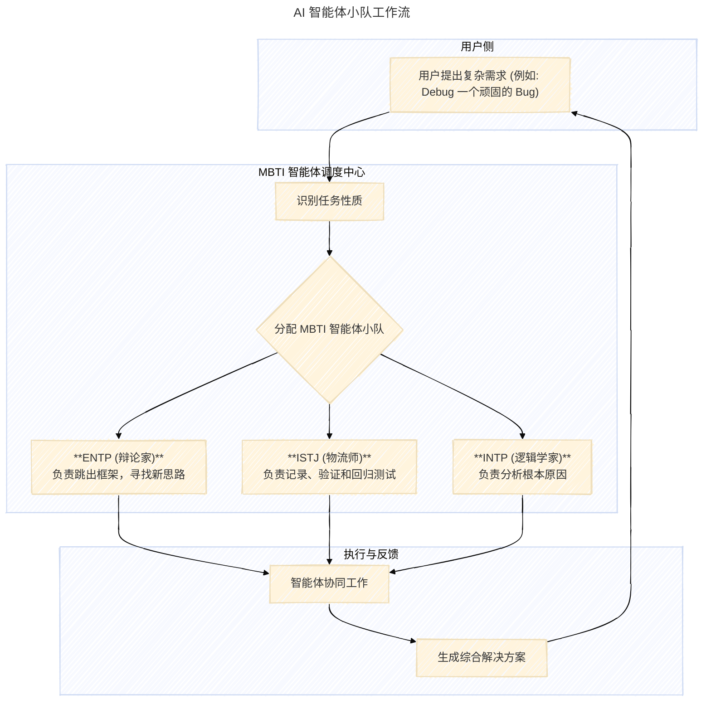

> 
> 在当今这个由代码构成的世界里，我们不断寻找着能与机器更高效、更和谐沟通的桥梁。当冷静的逻辑编程遇上温暖的人格特质分析，会碰撞出怎样的火花？这不仅仅是一次技术实验，更像是一场关于未来人机交互范式的哲学思辨。

### **核心洞见**

1.  **MBTI 作为高阶指令框架**：将 MBTI 十六型人格理论作为一种新颖的 Prompt Engineering 框架，能够赋予 AI 智能体更稳定、更具辨识度的“性格”，从而实现超越简单任务指令的深度交互。
2.  **`output style` 的魔力**：Claude Code 的 `output style` 功能为“黑客”行为打开了大门，允许开发者深度定制 AI 的系统级指令，是实现 AI 人格化与行为模式自定义的关键技术。
3.  **AI 智能体“小队”**：通过组建包含不同 MBTI “性格”的 AI 智能体小队（Agent Squad），可以模拟真实世界中的团队协作，利用不同“性格”的优势互补，更高效地解决复杂问题。
4.  **“情绪价值”是关键**：未来人机交互的突破点不仅在于功能的强大，更在于“情绪价值”的传递。一个懂得如何根据用户偏好进行沟通的 AI，能显著提升协作的流畅度与用户的接纳度。
5.  **语音交互是新大陆**：语音作为信息密度和情感浓度都极高的媒介，将成为提升人机交互带宽的下一个主战场。结合 ASR（语音识别）与 TTS（文本转语音）技术，我们正迈向一个更自然、更沉浸的 AI 协作时代。

## 周末“整活”：为 Claude Code 注入 16 种人格

故事的开端，源于一场关于 MBTI 的闲聊。社区成员 Weiyang 受到启发，萌生了一个有趣的想法：能否让他的编程助手 Claude Code 不再仅仅是一个没有感情的代码机器，而是拥有一系列“人格”，像一个真正的“同事”那样与他协作？

这个想法的核心，是**将 AI 交互从“任务驱动”转向“人格驱动”**。

在传统的交互模式中，我们向 AI 下达指令，AI 则返回结果。这种模式虽然直接，但往往缺乏灵活性和上下文理解力。Weiyang 的实验则试图打破这一局限，他构想了一种全新的工作流：

*   **单一任务，多人协作**：针对一个复杂的编程任务，不再是简单地将其分解，而是组建一个由 3-5 个不同“性格”的 AI 智能体构成的“小队”（Squad）。
*   **“性格”互补，各司其职**：团队中的每个 AI 智能体都被赋予了特定的 MBTI 人格。例如：
    *   **INTP（逻辑学家）**：负责进行深度思考、分析问题和探索创新的解决方案。
    *   **ESTJ（总经理）**：负责忠实地执行任务、管理待办事项列表（to-do list）并确保稳定性。
    *   **ENTP（辩论家）**：在遇到难以调试的 bug 时，负责跳出思维定势（jump out of the box），从全新的角度寻找突破口。

通过这种方式，AI 不再是一个被动的工具，而是一个能够模拟人类团队多样性的主动协作者。这种基于“人格”的智能体组合，为解决复杂问题提供了一种全新的、更动态的范式。



## 揭秘背后魔法：`output style` 与高阶指令注入

Weiyang 的奇思妙想得以实现，离不开 Claude Code 一个强大而略显“黑客”风格的功能——`output style`。

```ad-tip {什么是 Claude Code？}
Claude Code 是由 Anthropic 公司开发的一款运行在开发者终端（Terminal）中的 AI 编程助手。 [9, 12, 18, 20] 它深度集成于命令行环境，能够理解代码库的上下文，帮助开发者完成修复 Bug、重构代码、编写测试乃至生成文档等一系列复杂任务，旨在打造一种无缝、高效的“代理式编码”（Agentic Coding）体验。 [18]
```

`output style` 允许用户在系统层面（System Level）修改或注入提示词，从而彻底改变 Claude Code 的默认行为模式。这与我们在聊天框中输入的普通指令（User Prompt）有着本质区别：

*   **普通指令**：是临时的、一次性的，AI 在完成当次任务后可能就会“忘记”。
*   **`output style`**：则是持久的、系统级的，它将 AI 的行为模式固化下来，使其在后续的所有交互中都遵循这一“人设”。

Weiyang 正是利用了这一点，将 MBTI 人格理论变成了一套可以注入 AI 核心的“行为准则”。他的实现流程大致如下：

1.  **人格特征生成**：首先，借助另一个强大的 AI 模型 **KIMI**，为 16 种 MBTI 人格分别生成详尽的描述文档。 内容涵盖该人格的沟通偏好、思维模式、优点、潜在的“雷点”等。例如，对于一个 INTJ（建筑师）类型的 AI，描述中会强调其对逻辑、效率和未来规划的偏好。
2.  **构建 Style 文件**：将生成的描述构造成结构化的提示词，并存放在 `.claude/output-styles/` 目录下，创建自定义的 `output style` 文件。
3.  **激活人格**：在 Claude Code 终端中，通过 `/output-style <人格名称>` 命令，即可将 AI “变身”为指定的 MBTI 人格。

通过这种方式，Weiyang 成功地为冷冰冰的代码工具注入了“灵魂”。他创造的不再是一个简单的问答机器，而是一个由 16 个性格迥异、各有所长的“虚拟专家”组成的团队。

```ad-tip {MBTI 是什么？}
MBTI（迈尔斯-布里格斯类型指标）是一种人格类型理论工具，它将人的性格倾向分为四个维度，每个维度有两个方向，最终组合成 16 种人格类型。 [22, 26, 34, 38] 这四个维度分别是：
<ul>
    <li><b>能量来源 (E/I)</b>: 外向 (Extraversion) vs. 内向 (Introversion)</li>
    <li><b>认知方式 (S/N)</b>: 实感 (Sensing) vs. 直觉 (iNtuition)</li>
    <li><b>决策依据 (T/F)</b>: 思考 (Thinking) vs. 情感 (Feeling)</li>
    <li><b>生活态度 (J/P)</b>: 判断 (Judging) vs. 感知 (Perceiving)</li>
</ul>
在软件开发领域，某些特质组合（如 INTJ, INTP, ISTJ）被认为更具天然优势，因为它们往往与逻辑思维、系统分析和独立解决问题的能力相关。 [7, 24, 28]
```

## 超越功能：对“情绪价值”的终极追求

这场技术研讨会中，一个看似与编程无关的词被反复提及——**“情绪价值”**。

这恰恰是 Weiyang 实验最深刻的洞见：人机协作的效率瓶颈，很多时候并非源于技术，而是源于沟通。一个再强大的 AI，如果它的沟通方式让用户感到不适或难以理解，其价值也会大打折扣。

MBTI 人格化改造的核心，正是为了解决这一“情绪价值”的鸿沟。

*   **避免“踩雷”**：研讨中提到，与不同 MBTI 类型的人沟通，第一句话至关重要。说对了，可以迅速建立信任；说错了，则可能让对方心生抵触。通过让 AI 模拟用户的 MBTI 类型进行沟通，可以确保交流从一开始就在“同个频道”上，例如，它会知道对一个 INTJ 用户应该直截了当、逻辑清晰，而对一个 ENFP 用户则需要更富感染力和启发性的语言。
*   **从“工具”到“伙伴”**：当 AI 的回应方式符合用户的思维习惯时，用户会感到被“理解”和“尊重”。这种心理上的舒适感，会将人机关系从单纯的“命令-执行”提升为更紧密的“协作伙伴”关系，从而极大地激发用户的创造力和工作热情。
*   **拉满“情绪价值”**：一个懂得在恰当时机给予鼓励、在用户困惑时提供启发式引导、在任务完成时分享成就感的 AI，其提供的“情绪价值”是无价的。这使得枯燥的编程过程变得更具人情味，也更有动力。

最终，这场实验探索的是一个终极问题：我们能否创造出一个不仅在智力上、更在“情商”上与我们高度匹配的 AI 伙伴？Weiyang 的尝试，无疑为此给出了一个肯定的、充满想象力的答案。

## 语音革命：人机交互的下一个疆域

当个性化交互的话题走向深入，另一个焦点自然而然地浮现出来：**语音**。

如果说基于 MBTI 的文本交互是在“软件”层面提升沟通质量，那么语音交互则是在“硬件”层面彻底重塑沟通的带宽和维度。研讨会上，大家深入探讨了 ASR 和 TTS 技术在未来 AI 工作流中的巨大潜力。

```ad-tip {ASR 与 TTS}
<ul>
    <li><b>ASR (Automatic Speech Recognition)</b>: 自动语音识别，即将人类语音转换为书面文本的技术。它相当于 AI 的“耳朵”。 [1, 3, 5]</li>
    <li><b>TTS (Text-to-Speech)</b>: 文本转语音，即将书面文本转换为语音输出的技术。它相当于 AI 的“嘴巴”。 [2, 4, 6]</li>
</ul>
这两项技术结合，构成了完整、自然的语音交互闭环。 [3]
```

语音交互将带来颠覆性的变革：

1.  **输入带宽的飞跃**：语速远快于打字速度。开发者可以通过自然对话，快速描述需求、解释思路，甚至在“摸鱼”时也能口述完成任务，将信息输入的效率提升数倍。
2.  **情感与语境的传递**：语音天然携带了文本无法比拟的情感、语气和重音等信息。这些“副语言信息”能够让 AI 更精准地把握用户的真实意图和情绪状态，从而做出更智能、更具同理心的回应。
3.  **更自然的交互流**：未来的编程或许不再是“正襟危坐”于屏幕前。结合 AI 眼镜等可穿戴设备，开发者可以随时随地与他的 AI 伙伴进行语音交流，实现真正的“沉浸式编程”。
4.  **智能“润色”与“降噪”**：研讨中还提出了一个精妙的设想——在用户的口语和 AI 的“大脑”之间，加入一个轻量级模型。这个模型负责将口语化的、有时甚至前言不搭后语的表达，“润色”成逻辑严谨、结构清晰的指令，再交给核心 AI 执行，从而兼顾了输入的便捷性与指令的准确性。

当然，挑战也同样存在，比如开放式办公环境的噪音问题，以及语音输出（听）在信息接收效率上可能不及文本（读）。但无论如何，一个由语音驱动、情感互通的 AI 协作新时代，正向我们走来。

## 广阔图景：一个剧变中的生态

Weiyang 的 MBTI 实验并非孤立的技术炫技，它诞生于一个 AI 开发工具生态剧烈变革的时代背景之下。这场 Vibe Seminar 也如同一面棱镜，折射出当前生态的几个核心趋势：

*   **开放性与可“黑”性**：与会者们提到了 `Cursor` 等工具，尽管功能强大，但其“黑箱”式的运作模式让开发者感到不安。相比之下，Claude Code 凭借其开放的、可被“黑”（Hack）的特性，如 `output style`，赢得了极客们的青睐。这代表了一种趋势：开发者不再满足于被动使用工具，而是渴望深度掌控、定制乃至重塑自己的 AI 伙伴。
*   **人本与机本的博弈**：讨论中反复出现 `human readable`（人类可读）与 `machine readable`（机器可读）的对比。传统的编程更多是“人去迁就机器”，而 AI Agent 的浪潮则旨在实现“机器来理解人”。Weiyang 的实验，正是将 `human readable` 推向了极致——它不仅仅是语言的通俗易懂，更是思维模式与心理感受层面的“可读”与“共鸣”。
*   **社区驱动的创新**：这场研讨会本身就是社区力量的绝佳体现。一个源于闲聊的想法，在社区的交流碰撞中得以发酵、实现，并最终以开源的形式回馈社区。这种自下而上、由真实需求驱动的创新模式，正是 AI 应用时代最富活力的进化路径。

## 结语：机器之心，人性之光

从为代码注入 16 种人格，到畅想一个由语音驱动的未来，这场长达三个多小时的线上研讨，最终指向了一个共同的核心：**将“人”重新置于人机关系的中心**。

Weiyang 的探索，与其说是一个工程项目，不如说是一次充满人文关怀的尝试。它提醒我们，在追逐更强算力、更大模型的同时，不应忘记技术最终服务的对象——是拥有不同思维习惯、情感需求和个性偏好的我们自己。

当 Claude Code 遇上 MBTI，我们看到的不仅是代码与心理学的奇妙跨界，更是一个未来工作场景的缩影：在那里，AI 不再是冷冰冰的生产力工具，而是能够理解我们、适应我们、甚至启发我们的“数字心流”伙伴。

通往这个未来的道路依然漫长，但这场 Vibe Seminar 无疑为我们点亮了一盏充满人性光辉的指路明灯。