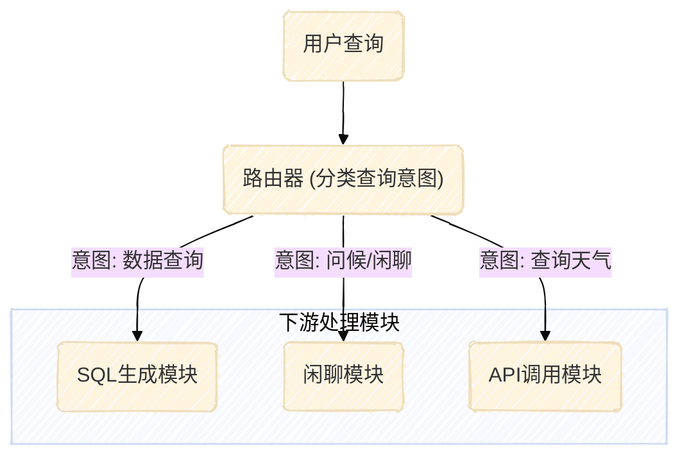
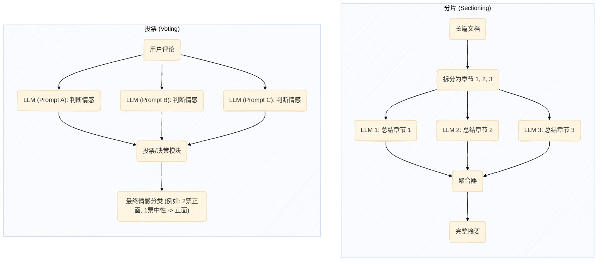
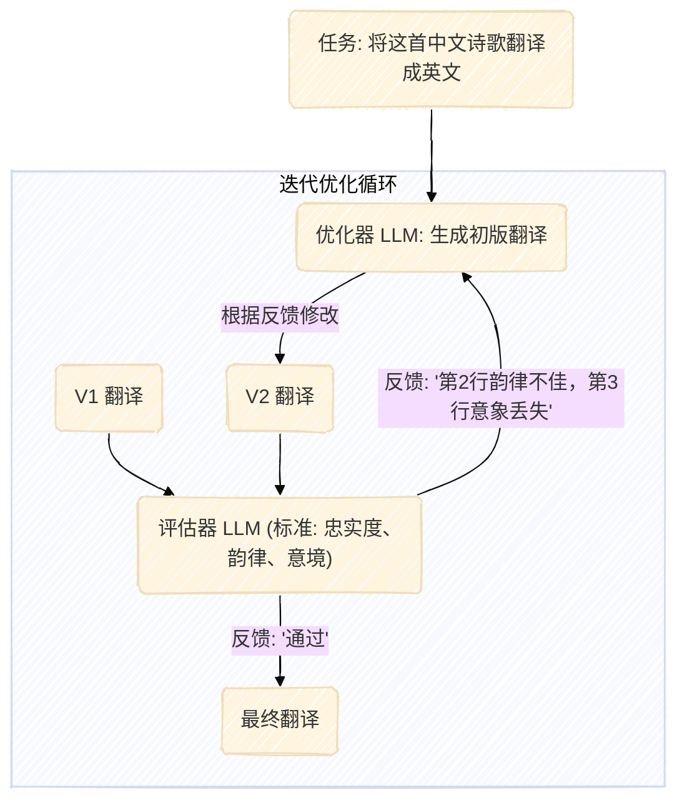

好的，请查收基于您提供的素材和要求生成的深度稿件。

---

# 万字长文：从第一性原理，构建高效能Agentic AI

## 文章引言

在人工智能的浪潮之巅，**Agentic AI**（AI代理或智能体）正从一个前沿概念，迅速演变为重塑技术边界的核心力量。它承诺的不仅仅是更智能的问答，而是一个能够自主理解、规划、并与数字世界交互的全新范式。然而，当炒作与期望齐飞，我们如何在喧嚣中回归本质，真正构建出强大、可靠且可信的AI系统？本文将深入探讨构建Agentic AI的第一性原理，为您揭示从简单提示到复杂多智能体系统的最佳实践。

## 核心洞见

*   **始于简约，终于实效**：成功的AI系统构建，关键不在于追逐最尖端的复杂性，而在于精准匹配业务需求。一切应从最简单的提示工程开始，通过严谨的评估进行优化，仅在必要时才引入多步工作流或智能体。
*   **架构分野：工作流 vs. 智能体**：Agentic AI系统主要分为两大类。**工作流（Workflows）**为定义明确的任务提供可预测性和一致性；而**智能体（Agents）**则在需要大规模灵活性和模型驱动决策时表现更佳。为特定场景选择正确的架构是项目成功的基石。
*   **透明度是信任的基石**：黑箱式的AI难以在企业级应用中获得真正信赖。通过显式展示AI的规划与推理步骤，不仅增强了系统的可调试性，更是建立用户信任、促进技术采纳的关键。
*   **ACI：AI与世界交互的“用户体验”**：我们必须像设计人机界面（HCI）一样，精心设计**代理-计算机界面（Agent-Computer Interface, ACI）**。清晰的工具文档、周密的测试以及“防错式”设计，是确保AI智能体能够可靠、高效地使用外部工具的核心。

---

## 第一章：正本清源，Agentic AI的真实内涵

在深入技术细节之前，我们必须首先对“Agentic AI”这一术语建立一个清晰、统一的认知。当前市场上的许多讨论往往将其局限于记忆（Memory）、工具使用（Tools）等具体功能，但这仅仅是表象。

从更根本的层面看，**Agentic AI是一种系统设计哲学，其核心在于将复杂的用户请求分解为一系列可管理、可执行的子任务，并由不同的专业组件协同处理。** 它摒弃了依赖单一、庞大的语言模型（LLM）“一次性”解决所有问题的幻想，转而拥抱一种模块化、可审计的解决路径。

这种“分而治之”的策略带来了显而易见的优势：
*   **更高的准确性**：每个组件可以针对特定的子任务进行深度优化，从而提升整体解决方案的精确度。
*   **更强的可控性**：我们可以对AI执行的每一步进行监控、验证和干预，有效减少了不可控的“幻觉”和错误。
*   **更好的可扩展性**：在模块化的框架下，添加新功能或集成新工具变得更加简单，系统能够随着业务需求的变化而平滑演进。

### 1.1 架构的光谱：从“巴萨式”工作流到“皇马式”智能体

Anthropic的研究进一步将Agentic AI系统划分为两种核心架构范式，这为我们理解和设计此类系统提供了一个极佳的思维框架：

1.  **工作流（Workflows）**：在这类系统中，LLM和工具的调用被预定义的代码路径严格编排。系统如同一个纪律严明的团队，每个成员（组件）的角色和协作方式都经过精心设计。
2.  **智能体（Agents）**：在这类系统中，LLM拥有更高的自主权，能够动态地指导自身的流程和工具使用，对如何完成任务保持着主导控制。为了与上位的Agentic AI设计哲学区分，我们姑且称之为**A2（Autonomous Agent）**系统。

我们可以用一个生动的比喻来理解这两种范式的差异：

*   **工作流系统**好比瓜迪奥拉执教下的巴塞罗那足球队。球队的战术体系（即预定义流程）被 meticulously 规划，每个球员的跑位、传球都有明确的指令。球员在场上依然拥有创造力，但这种创造力是为了更好地执行既定战术。在其巅峰状态，这种体系展现出极致的统治力和效率。然而，它的风险在于可能变得僵化和可预测，一旦某个关键环节（如核心球员）出现问题，整个系统可能面临崩溃。

*   **A2系统**则更像安切洛蒂执教下的皇家马德里。团队汇集了大量顶级球员（高质量的组件），教练设定一个相对宽松的总体目标，然后给予球员们极大的自由度，让他们依靠个人能力和场上默契去解决问题。在其最佳状态，这种体系表现出惊人的灵活性和韧性，能够应对各种意想不到的挑战，甚至在逆境中创造奇迹。然而，这种系统也更容易出现壮观的崩溃，当问题发生时，诊断和修复的难度要大得多，有时甚至需要对关键组件进行重构。

```mermaid
---
config:
  layout: dagre
  theme: base
  look: handDrawn
---
graph TD
    subgraph "Agentic AI 系统设计光谱"
        direction LR
        n1("工作流 (Workflow)")
        n2("混合模式 (Hybrid)")
        n3("A2 智能体 (Autonomous Agent)")

        n1 -- "增加灵活性" --> n2
        n2 -- "增加自主性" --> n3

        subgraph "n1 - 特点"
            direction TB
            n1_1("高可预测性")
            n1_2("高可靠性")
            n1_3("易于调试")
            n1_4("领域知识驱动")
        end

        subgraph "n3 - 特点"
            direction TB
            n3_1("高灵活性")
            n3_2("强适应性")
            n3_3("处理开放性问题")
            n3_4("通用能力驱动")
        end
    end```

在实践中，最优秀的Agentic AI系统往往位于这个光谱的某个中间位置，融合了两者的优点。然而，从个人经验出发，尤其是在构建面向低资源、高噪音和大规模环境的高性能机器学习系统时，我强烈倾向于**将大约80-90%的处理流程以工作流的方式进行严格定义**，仅在“最后一公里”交付时，才赋予系统动态调用和创造的自由。

这种偏向工作流的设计哲学，能带来更高的可靠性和精确性，从而有效地控制输出并对错误进行兜底，确保：
1.  **满足用户对精度的苛刻要求**：许多商业场景，如精确的报表格式化、遵循复杂策略构建法律论证等，是传统的单一LLM或高度自主的A2系统难以胜任的。
2.  **严格的成本控制**：A2系统如果陷入无意义的循环或触发意外错误，其计算成本可能会失控，这在面向消费者的SaaS平台中是不可接受的。
3.  **最小化失败成本**：由于流程清晰，构建检查点和容错机制变得更加容易。

当然，这种方法的挑战在于，它需要**海量的领域知识（Domain Knowledge）**来有效建立。以法律AI公司IQIDIS为例，其成功之处在于由律师主导产品设计，CEO和顾问团队会 meticulously 绘制出律师在案件中可能采取的每一个决策步骤，从而识别出投资回报率（ROI）最高的自动化环节。

### 1.2 战略选择：垂直深耕 vs. 水平扩展

这个架构选择的背后，也反映了深刻的商业战略考量：

*   **工作流驱动的系统更适合垂直领域的深耕**。它们能够将深度的领域知识编码到系统中，为特定行业的用户提供极致的性能和成本效益。
*   **A2驱动的系统则更适合水平化的通用平台**。它们固有的灵活性使其能够服务于更广泛的用户和更多样化的场景。

这也解释了为何大多数前沿AI研究（通常由大型科技公司主导）偏向于A2系统——它们的目标是通用性，而非特定领域的专业性。然而，一个常见的误区是，许多致力于开发垂直领域AI产品（AI for X）的团队，盲目地复制前沿AI实验室的研究路径，却没有意识到他们参与的是一场规则完全不同的游戏。

以法律科技领域为例，尽管初创公司和行业巨头已投入数十亿美元，但革命性的产品依然寥寥无几。许多产品在测试中表现平平，同时产生了高昂的云计算账单。这很大程度上是因为它们采用了错误的 playbook，过度追求通用性和模型的自主性，而忽视了法律工作流程中对精度、可追溯性和成本效益的刚性需求。

> `[image: 一张图表，显示近年来对法律科技领域AI创业公司的大量风险投资金额]`
> **图片说明**：巨额资本的涌入并未必然带来法律AI的革命性突破，这引发了我们对技术路径选择的反思。[来源：Crunchbase News](https://news.crunchbase.com/venture/ai-legal-tech-evenup-unicorn-bain/)

这一观察同样适用于金融、医疗等其他高度专业化的领域。

## 第二章：构建高效能智能体的三大支柱

基于对Agentic AI本质的理解，我们可以进一步深入探讨Anthropic总结的三大核心构建原则：**简约性、透明度、以及精心设计的代理-计算机界面（ACI）**。

### 2.1 支柱一：简约至上，“刚刚好”的力量

在机器学习工程领域，一个最宝贵的建议或许是：**克制你的技术冲动**。面对多智能体系统等前沿概念的诱惑，工程师们很容易陷入过度设计的陷阱，最终创造出一个难以调试、无法稳定工作的复杂怪物。

> `[image: 一个复杂的、纠缠在一起的流程图，旁边有一个简单的、线性的流程图，形成鲜明对比]`
> **图片说明**：复杂的系统架构可能导致生产力下降50%，缺陷密度增加三倍，以及员工流失率呈数量级增长。[引用自文章 "How bad is Architectural Complexity"](https://codinginterviewsmadesimple.substack.com/p/how-bad-is-architectural-complexity?utm_source=publication-search)

明智的第一步，是构建一个**极简的LLM代理**。这个代理的核心，是在基础LLM之上，增强三种基础能力：

*   **检索（Retrieval）**：赋予模型访问外部知识库的能力，例如通过检索增强生成（RAG）。
*   **工具（Tools）**：赋予模型与外部服务（如API、数据库、计算器等）交互的能力。
*   **记忆（Memory）**：赋予模型在多次交互中保持上下文信息的能力。

这种简约的架构，能显著加快迭代速度，降低开发成本，并使调试过程变得简单直观。更重要的是，一个更少出错、响应更快的系统，更容易与早期用户建立信任。

Devin和Cursor的对比是一个绝佳的例证。Devin基于一个更强大的多智能体架构，旨在实现更广泛的功能；而Cursor的架构则更接近上述的极简模型，专注于核心的编码辅助任务。然而，许多开发者更偏爱Cursor，因为它错误更少、速度更快，用户体验更流畅。这个案例有力地证明了，在用户价值层面，**可靠的简约胜过脆弱的复杂**。

### 2.2 支柱二：透明为王，照亮AI的“思考”过程

信任是任何AI应用成功的关键。如果一个系统给出的决策或产出缺乏解释，用户将永远无法完全信赖它，这将阻碍产品的推广和后续的迭代改进。因此，**透明度是高效能Agentic系统的命脉**。

一个透明的系统具备以下特质：

*   **可调试性**：当出现问题时，透明的系统允许开发者快速定位问题根源并进行修复，这是“黑箱”系统无法比拟的优势。
*   **用户信任**：公开展示智能体的推理路径和决策依据，能够有效打消用户的疑虑，鼓励他们更深入地使用和依赖产品。
*   **伦理考量**：透明的智能体也更符合伦理要求，因为它更容易被审查和监督，确保其行为符合道德和法规标准。

近年来，检索增强生成（RAG）技术之所以能超越微调（Fine-Tuning）和复杂的提示工程，成为企业级应用的首选，其核心优势之一就在于其内在的**透明性**和**可追溯性**。

> `[image: 一张来自Menlo VC的图表，显示RAG在企业GenAI应用中的采纳率远高于其他技术]`
> **图片说明**：RAG的崛起，很大程度上得益于其能够提供可验证的信源，从而建立用户信任。[图表来源：Menlo VC 2024 State of Generative AI](https://menlovc.com/2024-the-state-of-generative-ai-in-the-enterprise/)

IQIDIS的实践再次印证了这一点。其产品中的**文档引用功能**深受用户喜爱。该功能允许律师在AI生成的任何论点或声明旁边，直接看到并点击源自哪个原始文件的哪一段落。

> `[image: IQIDIS产品界面截图，展示AI生成的文本旁边有清晰的文档来源标注]`
> **图片说明**：通过提供精确到段落的溯源，用户可以轻松验证AI的产出，极大地提升了工作效率和信任度。（注：为保护机密，此为非法律文档示例）

更有甚者，IQIDIS向部分高级用户开放了底层的**嵌入和知识图谱可视化**。用户可以看到AI是如何理解案件文档中不同实体（如人物、地点、事件）之间的关系的。用户甚至可以手动编辑这些关系连接，将自己独特的领域知识和洞察注入AI，使其产出更符合个案的特殊情况。

> `[image: 一个知识图谱的可视化界面，展示了不同节点（如“Desktop Underwriter”和“Form 1003”）之间的连接关系]`
> **图片说明**：通过让用户能够审查甚至编辑AI的内部知识表示，系统从一个单向的“工具”转变为一个双向协作的“伙伴”。

**让用户能够验证和编辑AI流程的每一步，是让AI适应人的知识，而不是强迫人去适应AI的工具。** 这种深度透明的设计，从根本上解决了生成式AI应用中一个被广为诟病的问题：用户因不信任而花费在验证和调试输出上的时间，几乎抵消了AI带来的生产力增益。

### 2.3 支柱三：ACI，被忽视的英雄

我们对人机界面（Human-Computer Interface, HCI）的设计已经投入了数十年的研究和关注，力求让软件对人类用户友好。现在，我们必须以同等的严肃态度，来对待**代理-计算机界面（Agent-Computer Interface, ACI）**的设计——即AI智能体与其可调用的工具和服务之间的交互界面。

一个智能体仅仅“拥有”能力是不够的，它必须能够**可靠地、高效地“使用”**这些能力。ACI设计的优劣，直接决定了智能体在真实世界中的表现。

#### 2.3.1 高效ACI的四大设计原则

构建一个高效的ACI，需要遵循以下四个关键原则：

1.  **动作的简洁与清晰**：ACI应优先提供直接、易于理解的命令。避免用冗长复杂的文档和海量的选项来压垮智能体。命令应该像优秀的用户界面按钮一样，直观且目的明确。
2.  **操作的效率与整合**：将常见的复合操作（如文件查找并打开）整合成尽可能少的原子动作。高效的动作设计能让智能体在单步操作中取得实质性进展，避免因需要组合多个简单动作而陷入冗长的、易出错的交互循环。一个经验法则是：**如果你发现智能体总是在执行一个固定的长序列操作，那就应该为这个序列创建一个专用的高级命令。**
3.  **信息丰富的环境反馈**：高质量的反馈至关重要。当智能体执行一个动作后，ACI应返回关于环境当前状态和该动作所产生影响的、有意义的信息。反馈应力求简洁、切题，避免无关的噪音。例如，当智能体编辑一个文件后，ACI应返回更新后的文件内容片段，以便智能体确认修改成功。
4.  **防止错误扩散的“护栏”**：语言模型和人类一样会犯错，但它们从错误中恢复的能力通常要弱得多，很容易陷入无效的循环。因此，ACI需要内置“护栏”（Guardrails）。例如，一个集成了代码语法检查器的文件编辑工具，可以在智能体提交错误代码时立即拒绝并提示，从而防止错误被保存，帮助智能体及时发现并纠正问题。这借鉴了制造业中的“**Poka-Yoke**”（防错法）思想。

#### 2.3.2 案例研究：SWE-Agent如何通过卓越ACI征服软件工程任务

为了更具体地理解ACI的设计，让我们深入分析**SWE-Agent**的实现。SWE-Agent是一个旨在让语言模型扮演软件工程师角色的系统，它在知名的**SWE-Bench**基准测试中取得了SOTA（State-of-the-Art）的成绩。其成功的核心秘诀，就在于其卓越的ACI设计。

> `[image: 一张图表或标题，突出显示“ACI has been achieved internally: How to solve complex software engineering tasks with AI-Agents”]`
> **图片说明**：SWE-Agent的成功表明，精心设计的ACI是释放LLM在复杂领域（如软件工程）中潜力的关键。

SWE-Agent的ACI建立在标准的Linux Shell之上，但为其增加了几个专门设计的命令，完美体现了上述四大原则。

**1. 搜索与导航的优化**

在纯Shell环境中，LLM通常会笨拙地使用一连串`cd`, `ls`, `cat`命令来探索代码库，效率低下。即使使用`grep`或`find`，也常常被海量的无关结果淹没。

*   **SWE-Agent的解决方案**：它引入了`find file`, `search file`, `search dir`等专用命令。
    *   **简洁清晰**：命令的意图一目了然。
    *   **高效反馈**：这些命令返回的不是原始的、冗长的输出，而是经过处理的**简洁摘要**。同时，为了避免信息过载，搜索结果被限制在**最多50条**。如果结果超过50条，系统会友好地提示智能体“请优化你的查询，使其更具体”，主动引导智能体进行更有效的搜索。

这个设计点非常关键。最近的研究，如**[Diff Transformer](https://arxiv.org/abs/2410.05258)**，已经揭示了Transformer架构的一个内在缺陷：它们常常过度关注上下文中的无关信息（即注意力噪音）。因此，**提升LLM生成质量的最佳途径之一，就是主动减少它需要处理的无关信息量**。SWE-Agent的搜索机制正是这一思想的完美实践。

**2. 文件查看器的专注设计**

在找到目标文件后，纯Shell环境中的`cat`命令会一次性将整个文件内容倾倒到LLM的上下文窗口中，其中绝大部分内容都是无关的，这严重污染了LLM的“工作记忆”。

*   **SWE-Agent的解决方案**：它提供了一个交互式的文件查看器，通过`open`命令激活。
    *   **高效操作**：文件查看器每次只显示**最多100行**的内容。智能体可以通过`scroll down`, `scroll up`, `goto`等命令精确导航。
    *   **丰富反馈**：界面会清晰地显示当前文件的完整路径、总行数、以及当前窗口前后被省略的行数，为智能体提供了完整的上下文感知。
    *   **专注性**：这种设计强迫智能体将注意力集中在最相关的代码片段上，这对于生成有效的代码修改至关重要。

**3. 文件编辑器的防错机制**

在Shell中编辑文件通常依赖`sed`等工具或重定向操作，这些方法不仅笨拙，而且极易出错，缺乏即时反馈。

*   **SWE-Agent的解决方案**：它提供了一个强大的`edit`命令，与文件查看器协同工作。
    *   **简洁操作**：该命令接收三个参数（起始行、结束行、替换文本），允许智能体在单步操作中完成复杂的多行编辑。
    *   **即时反馈**：编辑应用后，文件查看器会**自动刷新**并显示修改后的内容，让智能体可以立即验证其操作结果。
    *   **内置护栏**：最关键的是，`edit`功能集成了**代码格式化检查器（Linter）**。如果智能体提交的修改引入了语法错误，该编辑将被**自动拒绝**，并返回错误信息，提示智能体重新尝试。这一小小的改动，极大地提升了系统的整体成功率。

通过这一系列精心设计的ACI，SWE--Agent为语言模型创造了一个高效、容错、信息丰富的交互环境，使其能够专注于解决核心的软件工程问题，而不是在与笨拙的工具搏斗中耗尽精力。

## 第三章：进阶之路，构建复杂任务的组合式架构

当掌握了简约、透明和ACI这三大基石后，我们就可以开始探索更复杂的架构模式，以应对更具挑战性的任务。这些模式通过将多个LLM调用或智能体组件以特定方式组合起来，实现`1+1>2`的效果。

### 3.1 模式一：提示链（Prompt Chaining）

**定义**：这是最基础的组合模式，它将一个复杂的任务分解为一系列线性的、 последовательные 的子任务，每个子任务由一个专门的提示（Prompt）来处理。前一个步骤的输出成为后一个步骤的输入。

```mermaid
---
config:
  layout: dagre
  theme: base
  look: handDrawn
---
graph TD
    n_input("用户输入") --> n_p1("提示 1: 生成大纲")
    n_p1 --> n_o1("输出 1: 文档大纲")
    n_o1 --> n_p2("提示 2: 扩展大纲")
    n_p2 --> n_o2("输出 2: 完整文档")
```

*   **适用场景**：当一个任务可以被清晰地分解为固定的、前后依赖的几个阶段时，提示链是理想的选择。它通过“关注点分离”的设计，使得每个环节的提示都更简单、更专注，从而更容易优化和调试。
*   **应用示例**：
    *   **多语言内容生成**：第一步，生成英文市场营销文案；第二步，将生成的文案翻译成法语。
    *   **结构化文档写作**：第一步，根据主题生成文档大纲；第二步，（可选）使用一个提示来评估大纲是否满足特定标准（如完整性、逻辑性）；第三步，根据通过评估的大纲来撰写完整的文档内容。

### 3.2 模式二：路由（Routing）

**定义**：路由工作流首先对输入进行分类，然后根据分类结果将其“路由”到最合适的下游任务或专业化组件。这个“路由器”本身可以是一个LLM调用、一个传统的分类器，甚至是一组规则引擎。



*   **适用场景**：当系统需要处理多种不同类型的输入，并且每种类型都有一个最佳的处理方式时，路由是必不可少的。如果不使用路由，试图用一个“万能”的提示来处理所有类型的输入，往往会导致在优化某一类输入时，损害了在其他类型输入上的表现。
*   **应用示例**：
    *   **智能客服**：一个路由器首先判断用户问题是关于“订单查询”、“产品咨询”还是“投诉建议”，然后将问题分发给专门处理该类问题的后端服务或知识库。
    *   **自然语言到SQL**：一个复杂的路由系统可以分析用户的自然语言查询，判断它需要关联哪些数据表，然后选择最合适的提示模板来生成SQL查询。

### 3.3 模式三：并行化（Parallelization）

**定义**：并行化工作流是指让多个LLM实例同时处理一个任务的不同部分或整个任务，然后以编程方式聚合它们的输出。它主要有两种变体：

1.  **分片（Sectioning）**：将一个大任务分解为多个可以独立并行处理的子任务。
2.  **投票（Voting）**：让多个实例使用相同或不同的提示重复执行同一个任务，以获得更多样化的输出或通过多数表决来提高结果的置信度。



*   **适用场景**：
    *   **分片**适用于那些可以被分解以提高处理速度的任务，或者需要对一个任务的多个不同方面进行独立评估的场景（如自动化评估）。
    *   **投票**适用于需要从多个角度审视问题以提高鲁棒性，或者需要平衡假阳性和假阴性的决策任务。
*   **应用示例**：
    *   **分片**：在内容审核系统中，一个LLM实例处理用户查询的核心业务逻辑，而另一个并行的实例专门负责筛选查询中是否包含不当内容。这种架构的性能通常优于让单个LLM同时处理业务和审核。
    *   **投票**：在代码漏洞审查中，可以使用多个不同侧重点的提示来审查同一段代码。只要有任何一个实例标记出问题，就可以触发警报。

### 3.4 模式四：协调器-工作者（Orchestrator-Workers）

**定义**：这是一种更动态的多智能体架构。一个中心的“协调器”（Orchestrator）LLM负责理解复杂任务，将其动态分解为子任务，并将这些子任务委派给专门的“工作者”（Worker）LLM（或工具），最后再综合工作者的结果形成最终答案。


*   **适用场景**：这是处理需要动态规划和多工具协调的复杂、开放式任务的理想模式。RAG系统，特别是那些包含意图识别、多路检索和个性化生成的高级RAG，本质上就是一种协调器-工作者模式。
*   **应用示例**：
    *   **高级RAG**：IQIDIS的系统就是一个例子。协调器首先对用户的法律问题进行分析（用户画像与意图识别），然后委派一个“上下文感知检索”工作者去查找最相关的法律条文和案例，最后由一个“个性化生成”工作者根据用户的背景和问题，将检索到的信息整合成一份条理清晰的法律备忘录。

### 3.5 模式五：评估器-优化器（Evaluator-Optimizer）

**定义**：在这个闭环工作流中，一个LLM调用（优化器）负责生成初始响应，而另一个LLM调用（评估器）则根据一组明确的标准对该响应进行评估和提供反馈。然后，优化器根据这些反馈进行迭代修改，直到满足评估标准。



*   **适用场景**：当任务的成功与否有明确的评估标准，并且通过迭代改进能够显著提升产出质量时，此模式非常有效。这类似于人类作者在创作一篇精美文章时经历的反复草拟、审阅和修改的过程。
*   **应用示例**：
    *   **文学翻译**：翻译LLM（优化器）可能无法一次性捕捉到原文的所有细微之处，但评估器LLM可以扮演一个有经验的编辑角色，提供有价值的批评和改进建议。
    *   **复杂信息检索**：在需要进行多轮搜索和分析才能收集全面信息的任务中，优化器负责执行搜索，而评估器则判断当前收集的信息是否足够回答问题，或者是否需要进一步的搜索。

## 结语：回归工程本质，构建可信的AI未来

Agentic AI的浪潮带来了无限的可能性，但也伴随着巨大的复杂性陷阱。本文从第一性原理出发，系统地梳理了从理念到实践的完整路径。

我们必须铭记，**成功的AI工程，不在于构建最复杂的系统，而在于为特定需求构建最合适的系统。** 这趟旅程应始于对**简约**的坚持，以一个仅包含检索、工具和记忆的核心智能体作为起点。随后，通过拥抱**透明度**，将AI的“思考”过程暴露给用户和开发者，从而建立起至关重要的**信任**。在此基础上，我们必须像对待最重要的产品功能一样，精心设计**代理-计算机界面（ACI）**，为AI与数字世界的交互铺平道路。

当我们必须应对更复杂的挑战时，提示链、路由、并行化、协调器-工作者和评估器-优化器等组合式架构，为我们提供了强大的工具箱。但工具的选择，必须服务于最终的目的，而非为了炫技。

在喧嚣的技术炒作中，回归工程的本质——**严谨、务实、以用户价值为核心**——才是引领我们穿越未知水域，最终抵达真正智能、可靠且可信的Agentic AI未来的唯一航灯。