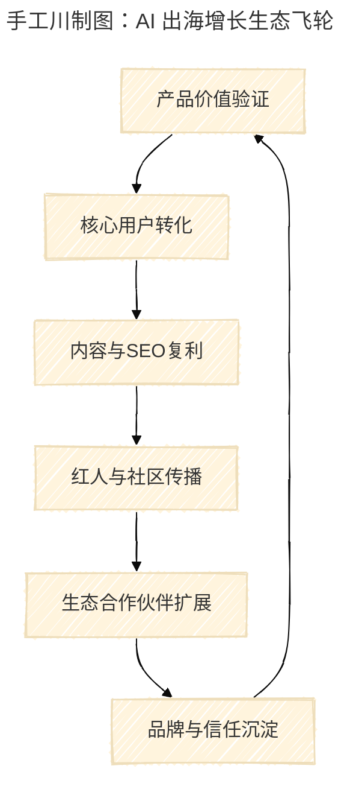

---

title: "AI出海万字纪要：从0到1的增长方法论与赢得全球开发者的开源战略"
date: 2025-10-25
excerpt: "一场关于AI出海、增长方法论与开源生态的深度研讨实录。由南川主持，Iris与Richard依次分享，系统拆解从0到1的产品出海策略、增长路径与全球化认知。"
source: "手工川社区闭门研讨会纪要"
----------------------

> **引言**
> 在“AI出海”成为创业者集体焦虑的2025年，这场闭门研讨会聚焦于如何从0到1构建全球增长路径、如何赢得开发者信任，以及在开源浪潮中重塑中国团队的全球竞争力。

---

### **Key Insights**

1. **出海不等于打榜**：真正的竞争力在于能否快速验证用户价值，而非短期曝光。
2. **产品成功的起点是用户洞察**：前10个高质量付费用户，比任何广告投放更重要。
3. **对标是效率，不是抄袭**：在全球市场中，锚定用户熟悉的对比点是快速建立信任的捷径。
4. **增长的秘密是结构化复利**：从访谈、转化、SEO、红人营销，到生态构建，皆可形成“自动化增长链路”。
5. **开源是全球信任货币**：赢得开发者，是中国AI团队全球化的终极壁垒。

---

## 一、出海热潮下的集体焦虑

南川开场指出，这次会议的契机来自社群中大量创业者的共同困惑——AI出海看似容易，实则选择迷宫重重。注册公司、上 Product Hunt、拉榜、找水军，这一整套看似标准化的流程，并不能真正解决增长问题。

“我们想用一次系统的讨论，把从产品到用户、从增长到生态的出海全路径拆开讲清楚。”
会议由南川主持，Iris 与 Richard 依次分享。

---

## 二、Iris：AI 出海的心态与五步方法论

Iris以自身从创业到在字节跳动负责 Lark 海外社区的经历为起点，提出了出海创业的五步通用框架：**学习 → 找对标 → 明确价值主张 → 获客 → 优化与规模化**。

她指出两个最常见的误区：

1. **“要先国内验证，再出海”——错。** 许多成功产品（如 Notion、Gamma、Hygiene）都是带着全球化基因一开始就出海。
2. **“国内模式照搬海外”——更错。** 不同文化的市场逻辑完全不同，复制国内玩法只会加速失败。

> “你必须打破自己的舒适区，真正去理解目标市场的头部对手与用户逻辑。”

Iris 强调，海外市场的核心是“**以用户为原点，生态为杠杆**”。许多中国创业者的问题在于事事亲力亲为——从销售到客服，从渠道到CS——但全球成功者早已通过生态系统放大自己。“你必须让上下游都能靠你的产品赚钱。”

```ad-tip SMB (Small and Medium Business)
海外的SMB企业往往拥有强劲的付费能力。一个10人团队年收入可达数百万美元。相比之下，中国的SMB生态刚刚起步，但AI时代让这一细分市场具备了新的成长土壤。
```

---

## 三、方法论第一步：找到前十个用户

“不要贪多，先找到十个真实的早期用户。” Iris 反复强调。

与其追求成千上万的注册，不如聚焦最早的核心用户群。这些用户不仅验证产品价值，也构成了后续增长的“样本库”。

她建议的具体策略包括：

* **精准触达竞品用户**：如在 Twitter 私信 Notion、Miro 等产品的粉丝，转化率约 1–15%。
* **使用自动化工具（Eggs Auto DM、Fat Butter）测试多套文案**，快速迭代消息触达策略。
* **利用 Fiverr 外包低成本扩展 LinkedIn 网络**，甚至可以 300 元雇佣印尼或越南自由职业者帮你加 200 个精准好友。

南川补充说：“我发现很多 AI 产品都有几百人内测群，但真正的关键是付费转化。能让10个人愿意掏钱的产品，比200人免费试用更接近 PMF。”

Iris 点头回应：“对，这就是早期创业者的盲区。访谈、复盘、再访谈，这才是通向 PMF 的必经路径。”

---

## 四、理解用户：访谈是增长的底层逻辑

Iris 将“用户访谈”定义为创业者的必修课。她总结了三个关键原则：

1. **让用户说话，不是你在讲。** 访谈中创始人只应占 20%。
2. **观察真实行为。** 要求用户共享屏幕，直观看他们如何使用产品。
3. **全程复盘与影像记录。** 访谈结束后截取典型片段发给产研团队复盘。

她补充，访谈不仅是信息收集，更是关系建立：“愿意接受访谈的用户，本身就是你品牌的种子传播者。”

南川追问是否有推荐的热力图工具。Iris 回答：“微软的 Clarity 很好用，可以看到点击轨迹和录屏。更系统的可用 Mixpanel 或 Posthog。”

```ad-tip 可解释性访谈 (Interpretability Interview)
与量化数据不同，访谈的目标是揭示用户行为背后的动机与思维链条。这种“可解释性访谈”帮助团队理解问题的成因，而不仅是症状。
```

---

## 五、从SEO到红人营销：冷启动的增长路径

进入增长环节，Iris 将出海增长拆解为三类策略：SEO、广告投放与红人营销。她提出一个核心观点：“**SEO 是最具复利的增长方式，但前提是结构优化**。”

她建议：

* 使用 `seo checker` 检测网站结构评分，至少要达到 85–90 分再开始内容建设；
* 使用 **programmatic SEO（程序化 SEO）** 批量生成落地页，以关键词为核心。

> “你要针对每个关键词，建一个对应的落地页，而不是写一篇泛泛的博客。”

南川对此表现出极大兴趣，进一步追问了“关键词排名成本”“KD 值计算”等细节，Iris 建议通过 **Ahrefs 或 SEMrush** 查询关键词难度（20–35较佳），并以长尾词起步。

在红人营销部分，她补充了海外谈价技巧：“Twitter 上 10 万粉以下的博主，一个 thread 报价 150 美金算合理，别被虚价吓到。”

```ad-tip Programmatic SEO（程序化SEO）
通过自动化脚本和模版，生成数百个结构一致、内容差异化的落地页，以提升搜索覆盖度和转化率。这是 AI 工具类创业者低成本冷启动的关键手段。
```

---

## 六、Richard：技术、生态与长期主义的出海逻辑

Richard 在下半场的分享中，从技术与生态角度补充了出海的“第二增长曲线”：**信任 × 工具链 × 开源战略**。

他指出，中国团队在技术执行力上已不输西方，但在“**信任系统建设**”上仍存在差距。

> “开源不只是产品策略，而是全球信任的货币。开发者愿意为信任买单。”

他进一步分析了几个成功案例：

* **Supabase** 以“Firebase 的开源替代品”快速建立认知锚点；
* **Vercel** 通过生态拉动，构建前端开发者网络；
* **Notion** 则以审美和社区重新定义文档工具。

这些案例背后共通的逻辑是：**以生态形成增长飞轮。**

Richard 认为，出海团队需要构建三个层次的生态：

1. **开发者生态**：让开发者能“用你的平台挣钱”。
2. **社区生态**：以用户故事驱动信任与复购。
3. **合作伙伴生态**：建立上下游收益共生。



Richard 强调：“真正的长期主义不是慢，而是构建持续复利系统。”

---

## 七、结语：赢得全球开发者的开源战略

在最后的自由讨论环节，南川总结：

> “出海不是逃离，而是重新定义。它迫使我们重新思考什么是用户价值、什么是品牌信任、什么是可持续增长。”

这场研讨会最终形成共识：

* **用户是出海的第一语言；**
* **社区是增长的中枢神经；**
* **开源是跨文化的信任桥梁。**

Iris 的方法论与 Richard 的生态论共同勾勒出中国AI团队的下一条出海曲线：从战术模仿到认知跃迁，从短期投放到长期信任。

> **本文基于手工川社区闭门研讨实录整理，经发言人确认后公开。**
