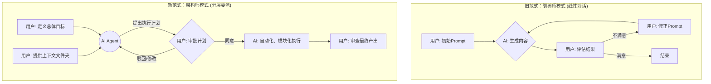

> AI Agent正在吞噬世界。过去，我们惊叹于与AI“对话”的能力；现在，真正的生产力革命在于学会如何“指挥”AI。这不仅仅是效率的提升，更是一种全新的工作范式——一种属于我们每个人的，“Vibe牛马”的范式。

### **核心洞见 (Key Insights)**

*   ### **从聊天到指挥**
    工作流的中心正在从“提示词工程师”转变为“项目架构师”。我们不再需要一句句地引导AI，而是定义目标、提供上下文，然后将执行权交给Agent。

*   ### **万物皆可编程**
    “编程式写作”的理念可以泛化到一切知识工作中。无论是写报告、做市场分析还是管理项目，核心都是将任务模块化，用系统工程的思维来驱动AI完成。

*   ### **IDE成为新入口**
    Agentic IDE（如Codex、Claude Code）正在取代简单的对话框，成为与大模型交互的主要界面。它们是为“干活”而生的，而非“聊天”。

*   ### **风格是最终护城河**
    当AI能够以极低成本生产高质量内容时，稀缺性不再是内容本身，而是独特的个人风格、思考框架和审美。你的“壳”比AI填充的“核”更重要。

## **引言：欢迎来到“Vibe牛马”时代**

“写作就像打螺丝。”

这是我的朋友，大V咸鱼在他那篇《AI写作指南3.0》里的开场白。这句话糙理不糙，精准地道出了当下内容创作乃至一切知识工作的本质——在AI的加持下，我们正从手工艺人，加速转变为流水线上的“架构师”。

过去一年，AI应用最大的变量是什么？不是又多了几个能写诗作画的聊天机器人，而是以Claude Code为代表的编程Agent，正在以一种近乎蛮横的姿态，吞噬绝大部分AI应用的使用场景。

<!-- 评注建议：这里可以引申一下，提一嘴最近一两个你观察到的、被Agent颠覆的具体工作场景，比如自动生成周报、自动化处理邮件等，增加代入感。 -->

这个趋势，嗅觉敏锐的人早已察觉。以前你可能打开一个网页，在对话框里小心翼翼地构造Prompt，与大模型反复拉扯，像个耐心的老师教一个聪明的学生。现在，越来越多的人选择直接打开终端，用Agentic IDE来“下命令”。

写代码是这样，写文章是这样，做市场分析、写项目报告、管理日常任务……无一例外。我们与AI的交互方式，正在发生一场深刻的革命：**从对话（Conversation）转向指挥（Command）。**

这就是我今天要聊的主题——“Vibe牛马”。

这个词听起来有点自嘲，但内核却无比严肃。它描述的是一种新的工作状态，一种全新的生产力范式。在这个范式里，我们不再是重复劳动的“牛马”，而是掌握了强大AI执行能力的“超级牛马”。我们提供思想、框架和意图，AI则作为我们意志的延伸，去完成那些结构化的、工程化的执行任务。

这篇文章，我想用一万字的篇幅，和你聊透这种新范式。它关乎工具，但更关乎思维。它将告诉你，如何利用Agentic IDE和各大平台的API，将自己从繁琐的执行中解放出来，真正成为一个思考者和创造者。

别再满足于和AI聊天了。让我们学会指挥它，让它为我们干活。

```ad-tip 什么是Agentic IDE？

Agentic IDE（智能体开发环境）是一种集成了AI Agent能力的编程或工作环境。与传统IDE（集成开发环境）主要服务于程序员不同，Agentic IDE将交互的重点从具体的代码编写，提升到了对任务意图的理解和自动化执行上。用户可以用自然语言描述一个宏大的目标（如“帮我分析这份财报并生成PPT”），IDE内置的AI Agent会自主地将任务拆解成多个步骤、调用合适的工具（如代码解释器、API、文件系统），并最终完成任务。它标志着人机协作从“工具使用”向“任务委派”的转变。
```

## **第一部分：范式转移——从“驯兽师”到“架构师”**

要理解“Vibe牛马”的工作模式，我们首先要厘清一个根本性的转变：我们与AI的角色关系变了。

### **旧范式：人是AI的“驯兽师”**

在ChatGPT引爆舆论的时代，我们最津津乐道的是“Prompt Engineering”。那时候，我们把自己定位成一个“驯兽师”。

我们坚信，AI是一头潜力无限但野性难驯的猛兽。我们需要通过精心设计的提示词（鞭子和口令），一句一句地引导它、修正它、塑造它，最终让它“吐出”我们想要的结果。

这个过程充满了不确定性，有点像抽卡。同一个Prompt，两次运行的结果可能大相径庭。为了追求一个完美的结果，我们可能需要花费数小时，在对话框里进行几十轮的“微调”。这本质上是一种“手工作坊”式的生产，效率和稳定性都高度依赖于“师傅”的手艺——也就是你构造Prompt的能力。

这种模式下，AI是“被动”的。它等待你的指令，执行你的指令，然后停下。你戳一下，它动一下。整个工作流的推进，完全依赖于人的持续介入。

### **新范式：人是AI的“架构师”**

Agentic IDE的出现，彻底改变了游戏规则。它带来了一种“架构师”思维。

现在，你不再需要关注每一个执行细节。你的角色被提升到了一个更高的维度：**定义目标、划定边界、提供资源、验收成果。**

这就像一个建筑项目的总架构师。你不会去亲自搬砖或和水泥，你的工作是：

1.  **明确意图 (Define Intent)**：清晰地告诉AI Agent，你要造一栋什么样的房子。比如，“我要写一篇关于‘Vibe牛马’的文章，篇幅一万字，核心观点是……，风格要像咸鱼那样……”
2.  **提供蓝图与物料 (Provide Context)**：把所有相关的资料都扔给它。这可能是一个项目文件夹，里面包含了：
    *   **核心资料**：你口述录音的转录稿、相关的研究报告、数据表格等。
    *   **风格范本**：几篇你认为风格优秀的参考文章。
    *   **约束文件**：一个配置文件（比如`claude.me`），里面定义了通用的指令和输出要求。
3.  **授权执行 (Authorize Execution)**：下达一个总指令，然后放手。比如，“开始吧，先给我一份详细的提纲。”
4.  **审查与迭代 (Review & Iterate)**：AI会开始它的工作。它可能会先阅读所有文件，然后提出一个计划（例如文章提纲），征求你的同意。你审查这份计划，提出修改意见（“第二部分逻辑有点乱，重新组织一下；第四部分要加强哲学思辨”）。AI会根据你的反馈进行修改，然后继续下一步，模块化地完成整个任务。

<!-- 评注建议：这里可以用一个Mermaid图来形象地对比新旧两种范式的工作流程，视觉上会更清晰。旧范式是线性、循环的对话，新范式是分层、委派的架构。 -->



看到了吗？在新范式下，人和AI的交互频率大大降低，但交互的质量却急剧提升。你不再关心“这句话该怎么说”，而是关心“这个结构对不对”。你的精力，从具体的“遣词造句”中解放出来，聚焦于更高层次的“谋篇布局”。

这是一种权力的让渡，也是一种心智的解放。你把执行的权力下放给AI，换来的是自己思考的自由。这正是“Vibe牛马”范式的核心精髓：**最大化人的思考价值，最小化人的执行成本。**

## **第二部分：“万物皆可编程”——非程序员的Agentic工作流**

咸鱼在他的文章里提出了“编程式写作”，这是一个绝妙的切入点。但我想说的是，这种思维远不止于写作。它是一种普适性的方法论，可以应用于几乎所有的知识工作领域。

其核心，就是把任何一项复杂任务，都看作一个“项目工程”，然后用模块化的思想来解构和执行它。

让我们来看几个非编程领域的具体实例。

### **实例一：市场分析报告自动化**

**场景**：你是一个市场分析师，老板让你花两天时间，研究一下“AI Agent”赛道的最新动态，并写一份分析报告。

**传统做法**：

1.  打开Google和各种数据库，搜索关键词，一篇一篇地看报告，手动复制粘贴关键信息到Word或Notion。
2.  整理杂乱无章的笔记，试图理出头绪，搭建报告框架。
3.  打开Word，吭哧吭哧开始写。字数不够，东拼西凑。图表不美观，在PPT/Excel里反复调整。
4.  两天后，交出一份可能自己都不太满意的报告。

**Agentic工作流**：

1.  **准备阶段 (Setup)**：
    *   创建一个项目文件夹，命名为`ai_agent_market_analysis`。
    *   **`data`子文件夹**：把你找到的所有资料——券商研报PDF、行业新闻链接、竞品官网的介绍文本、访谈录音转录稿——全部扔进去。
    *   **`templates`子文件夹**：放一个你之前写过的、格式最满意的报告模板（`.docx`或`.md`文件）。
    *   **`style_guides`子文件夹**：放几篇你认为写得最好的行业分析文章，作为风格参考。
    *   **`main_prompt.txt`文件**：写下你的核心指令。

2.  **指挥阶段 (Command)**：
    *   打开你的Agentic IDE（比如终端里的Claude Code），进入该项目文件夹。
    *   发出指令：“`@codex aask "根据'main_prompt.txt'里的要求，开始分析。"`”

    `main_prompt.txt`里的内容可能是这样的：
    > 我要写一篇关于AI Agent赛道的市场分析报告。请你：
    > 1.  阅读`data`文件夹里的所有资料，提取核心信息。
    > 2.  参考`templates`里的报告模板的结构。
    > 3.  模仿`style_guides`里文章的分析逻辑和语言风格。
    > 4.  报告应包含以下部分：市场规模预测、主要玩家分析（技术路径、商业模式）、未来趋势、投资建议。
    > 5.  首先，请给我一份详细的报告大纲。

3.  **交互与生成 (Interact & Generate)**：
    *   AI Agent会开始工作，几分钟后，它会返回一份详细的大纲。
    *   你审查大纲，提出修改意见：“`主要玩家分析部分，补充对开源Agent框架的讨论。`”
    *   Agent更新大纲。你确认后，回复：“`很好，按照这个大纲生成全文。`”
    *   Agent会开始模块化地写作，一部分一部分地生成内容。你甚至可以看到它在生成过程中，会引用`data`文件夹里的具体某份文件作为信息来源。

这个流程下来，你可能只需要半天时间，就能得到一份信息翔实、结构清晰、风格统一的报告初稿。而你在这半天里做的事情，不是信息的“搬运工”，而是知识的“架构师”和“质检员”。

### **实例二：社交媒体内容矩阵自动化**

**场景**：你是一个创业公司的运营，需要为下个月的社交媒体（公众号、即刻、小红书）规划内容，并撰写初稿。

**Agentic工作流**：

1.  **准备阶段 (Setup)**：
    *   项目文件夹`social_media_content_nov`。
    *   **`brand_assets`文件夹**：放入公司的品牌故事、产品介绍、目标用户画像、设计规范等文件。
    *   **`content_pillars.txt`**：定义你的内容三大支柱，例如“行业干货”、“产品教程”、“用户故事”。
    *   **`platform_style.json`**：定义不同平台的风格要求。
        ```json
        {
          "公众号": "深度长文，专业、有洞见，配图严谨。",
          "即刻": "短小精悍，追热点，多用emoji，口语化。",
          "小红书": "标题党，图片导向，多用标签，以教程和种草为主。"
        }
        ```
    *   **`main_prompt.txt`**：
        > 任务：规划并生成公司11月的社交媒体内容。
        > 1.  围绕`content_pillars.txt`中的三大主题。
        > 2.  参考`brand_assets`里的品牌信息。
        > 3.  为公众号、即刻、小红书三个平台，各规划4篇内容。
        > 4.  首先，以表格形式输出一份内容日历（包含日期、主题、标题、平台）。

2.  **指挥与生成 (Command & Generate)**：
    *   Agent接收指令后，会先生成一份Markdown格式的内容日历。
    *   你确认日历后，可以进一步指挥：“`很好，现在请为公众号的第一篇文章《AI Agent如何赋能中小企业》撰写全文，要求8000字。`”
    *   AI完成长文后，你继续：“`将这篇文章改写成一篇适合即刻发布的短文，和一篇小红书种草笔记。`”

<!-- 评注建议：可以再补充一个更个人化的例子，比如如何用Agentic工作流来管理个人知识库（PKM），比如整理阅读笔记、自动生成Zettelkasten卡片等，让读者感觉到这个方法论不仅能用于工作，也能提升个人生活效率。 -->

看到了吗？“编程”这个词在这里已经超越了代码的范畴。它是一种思维方式：**输入（上下文）-> 处理（AI Agent）-> 输出（结构化产物）**。你的工作，就是设计好这个流程，准备好高质量的“输入”，然后对“输出”进行评估和迭代。

## **第三部分：“Vibe牛马”的工具箱**

聊完了思维，我们再来谈谈具体的工具。

一个普遍的误区是，很多人会纠结于“到底哪个模型更好？”。但在Agentic工作流的框架下，这个问题的重要性在下降。

就像咸鱼说的，当Agent把一个宏大任务拆分到足够细，比如一次只写三四百字的一个小模块，那么模型之间的差异在很大程度上就被抹平了。这个逻辑非常像现代制造业，比如富士康，把一部iPhone的生产拆解成上千个极度简单的工序，每个工序上的工人不需要是天才，只要能拧好一颗螺丝就行。

编程Agent扮演的，就是那个“生产线管理者”的角色。它负责拆解任务、分配任务、管理流程。而背后的大模型，就是执行具体工序的“工人”。

所以，选择工具的核心，不是看它背后的模型有多聪明，而是看这个“管理系统”是否顺手、高效、开放。

```ad-tip API是真正的基石

Application Programming Interface（应用程序编程接口）是这一切能够实现的技术基础。各大模型厂商（OpenAI, Anthropic, Google等）通过API，将他们强大的模型能力开放出来，让开发者可以像调用一个函数一样使用AI。Agentic IDE本质上就是一个高度封装的、带用户界面的API客户端。它让你无需编写复杂的代码，就能利用API来构建自己的自动化工作流。理解API，是理解这场生产力革命的关键。
```

目前市面上的主流选择：

*   **Claude Code**：目前最主流、社区最活跃的Agent。优点是整合度高，入门相对简单，网上教程也多。缺点也明显：贵，而且上下文窗口（Context Window）容易被复杂的项目占满，导致Token消耗巨大或需要频繁清空重来。

*   **OpenAI's Assistants API / Codex**：作为最早的探索者，OpenAI的生态系统非常强大。如果你本身就是开发者，基于它的API构建自己的Agent工作流会非常灵活。对于普通用户，它更多地被集成在第三方应用中。

*   **Gemini CLI / Project IDX**：Google的后发优势在于其超长的上下文窗口和多模态能力。在处理超长文档（比如一口气读完一本PDF书再做分析）和复杂项目时，Gemini 2.5 Pro的上下文管理能力要比Claude从容得多。而且，它更便宜。

*   **国产Agent与IDE**：国内的大模型厂商也在快速跟进，比如阶跃的电脑助手、Qwen的Agent能力等。它们的优势在于本土化服务和更低的使用成本，值得关注。

**我的建议是：不要陷入“工具拜物教”。**

随便选一个你觉得顺手的开始用。核心是尽快建立起“架构师思维”和“项目化”的工作习惯。你甚至可以像咸鱼那样，用Claude Code的前端，但把后端调用的模型换成Kimi或者Gemini，取各家之长。

关键在于“用起来”。只有在实际解决问题的过程中，你才能真正体会到这种新范式的威力，并逐步构建起属于你自己的、高效的、个性化的工作流。

## **第四部分：风格的胜利——当AI负责生产，我们负责什么？**

聊到这里，我们必须面对一个终极问题：如果AI能完成大部分执行工作，那我们人类的价值在哪里？

我曾因此焦虑过，但现在我想通了。AI取代不了人，它只是彻底改变了价值的衡量标准。在内容和知识生产领域，**执行的价值正在无限趋近于零，而风格的价值正在无限放大。**

内容行业，本质上就是“套壳”的生意。

约瑟夫·坎贝尔在《千面英雄》里早就告诉我们，全世界的神话故事，都源于同一个“英雄之旅”的原型。离开-启蒙-回归，17个阶段，排列组合，构成了从《奥德赛》到《星球大战》的一切。故事原型早就被写完了，但我们依然需要新的故事。

为什么？因为我们迷恋的，是那个“壳”——那个独特的叙事风格、美术设定、世界观构建。

《星球大战》的故事内核，说白了就是太空版的《哈姆雷特》。但它套上了一个“银河帝国”的壳，用光剑、原力、千年隼这些极具风格化的元素填充细节，于是就成了几十年来最有影响力的IP。这个“壳”的价值，远远超过了故事内核本身。

写作不值钱，AI一分钟可以写一万字。但风格是稀缺的，风格是值钱的。

<!-- 评注建议：这里可以结合你自身的经历，谈谈你是如何形成“手工川”这个IP的风格的。是刻意为之，还是自然流露？这会让文章更有说服力和亲和力。 -->

互联网上那些我们称之为“神人”的创作者，比如户晨风、峰哥，或者“六神磊磊读金庸”，他们成功的秘诀是什么？是建立了自己独一无二的“壳”。

他们有自己的一套思考框架，有自己的语言风格。世界上的任何事，都可以被拖拽到他的框架里，用他的风格重新解释一遍。六神磊磊能用金庸的江湖解读一切国际时事，这就是他的“壳”。你当然可以说这种框架是贴标签、是简化，但你无法否认它的独特性和辨识度。

在AI时代，我们每个知识工作者，都应该致力于成为一个“风格建筑师”。你需要构建两样东西：

1.  **你的思维框架（The Framework）**：你看待世界的方式，你分析问题的模型。这是你的“骨架”。
2.  **你的语言风格（The Voice）**：你表达思想的腔调，你遣词造句的习惯。这是你的“血肉”。

当你有了这两样东西，你就拥有了一个无法被AI复制的“壳”。然后，你可以把这个“壳”变成一个API接口，让AI来填充内容。

想输出一篇“手工川”风格的科技评论？很简单。把我的100篇文章作为风格范本，把我的核心观点作为指令，AI就能惟妙惟肖地模仿我的语气，写出一篇看起来很“手工川”的文章。

但这并不可怕。因为读者消费的，不仅仅是这篇文章，更是“手工川”这个品牌背后一以贯之的思考和审美。AI可以模仿一次，但无法持续地、创造性地演进我的风格。风格的建立，来源于你过去的经历、你读过的书、你犯过的错、你的性格、你的偏见——这一切的总和，是AI无法拥有的。

所以，做自己，在这个时代，不再是一句鸡汤，而是一条商业铁律。

你能建立自己的风格，并能稳定地执行它，这就是一个没有竞争的、极为稀缺的事情。因为没有人比你更懂你自己。

## **总结：成为一个“超级牛马”**

让我们回到最初的起点。

AI写作指南3.0，或者说“Vibe牛马”工作法的核心，一以贯之：**人提供原创思想，AI负责结构化执行。**

由于Agentic IDE的出现，AI的执行变得高度自动化和工程化。我们不再需要像“驯兽师”一样在对话框里抽卡，而是可以像“架构师”一样，提供上下文，下达指令，让AI自动化地、模块化地完成工作。

这个过程，把我们的工作从“手工作坊”升级为了“现代工厂”。

但最重要的，永远是工厂里要生产什么。而这，取决于你，取决于你的风格，你的思考，你的审美。

所以，别再焦虑AI会不会让你失业了。你应该焦虑的是，你有没有建立起自己独特的风格。

让读者、让老板、让客户，能一眼就认出，这是你的东西，这是你的风格。当你做到这一点，AI就不是你的竞争对手，而是你手里最强大的那把螺丝刀。

最后，附上咸鱼分享的那个`Claude.me`项目配置文件，你可以把它作为自己工作流的起点。把它保存下来，放进你的每一个项目文件夹里。

一个新时代，已经开始了。

```
# 写作项目配置文件

# Role: 你现在是我的首席助理，一个世界级的项目经理和研究员。
# Goal: 你的任务是理解我提供的所有上下文，并根据我的核心指令，高效、精准地完成任务。

## 通用约束
- 优先使用我提供的文件作为信息源，其次是网络检索，最后才是你的内置知识。
- 对关键术语进行解释。
- 保持专业、严谨、有洞见的风格。
- 最终交付物必须是完整的、纯粹的Markdown文本。
```

（本文配图由 Midjourney 生成，全文由Claude Code辅助写作，我手动修改的部分，不超过500字。）