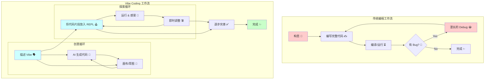

> 我曾以为代码是一面冰冷的高墙，上面刻满了普通人无法理解的规则与符号。直到我发现，在 AI 的帮助下，编程可以像对话、像涂鸦、像呼吸一样自然。我们需要的，或许不是更严谨的逻辑，而是更准确的“感觉”。

### **核心洞察 (Key Insights)**

*   **编程范式正在转变**：我们正在从精确指令的“语法时代”，迈入描述意图的“感觉时代”（Vibe Era）。
*   **AI 是翻译官而非计算器**：新一代的编程核心，在于如何将你的“感觉”和“意图”精准地翻译给 AI 助手，而非自己写出每一行代码。
*   **“Vibe Coding” 不是魔法，是思维方式**：它是一种全新的工作流，融合了自然语言、可视化草图和即时反馈，极大地降低了创造的技术门槛。
*   **人人都能成为创造者**：这套方法论，旨在帮助设计师、产品经理、作家，以及任何对代码有好奇心或恐惧感的人，跨越鸿জিং的技术鸿沟，将想法变为现实。

---

## **引子：那段被 VSCode “劝退”的岁月**

这个故事，可能要从三年前一个充满挫败感的深夜说起。

那时的我，和许多人一样，怀揣着一个“改变世界”的 App 梦。我听说 Python 是最好的入门语言，于是买了几本厚厚的教程，在电脑上装好了 VSCode，那个深蓝色的图标，在当时的我看来，就是通往极客世界的神圣大门。

我跟着教程，敲下了第一行 `print("Hello, World!")`。终端里成功显示出那行小小的文字时，我确实感受到了短暂的喜悦。但这份喜悦，很快就被无尽的细节和挫败感淹没了。

是 `_` 还是 `-`？这个缩进为什么又报错了？什么是环境变量？什么是依赖包冲突？我的大部分时间，都耗费在与这些琐碎、抽象的规则搏斗上。我感觉自己不像一个创造者，更像一个在黑暗中摸索的语法校对员。代码的世界，对我来说，是一面冰冷坚硬的墙，上面充满了尖锐的棱角，每走一步都会被划伤。

我看着屏幕上闪烁的光标，又看了看教程里那些大神们轻松写意的样子，一种强烈的“不属于感”油然而生。我，或许真的没有所谓的“编程天赋”。

于是，我放弃了。VSCode 被我拖进了回收站，那个 App 的想法，也连同那些未竟的代码，一同被尘封在了硬盘的某个角落。

<!-- 评注建议：这里可以插入一段对手工川自己过去学习编程的真实感受，增加文章的真诚度和代入感。可以谈谈自己遇到的第一个 bug，或者第一次被某个技术概念难住时的心情。 -->

时间快进到今天。当我看到一个设计师朋友，只用几句自然语言和一张随手画的草图，就在几分钟内生成了一个功能完备的网页时，我被深深地刺痛了。

他没有配置环境，没有纠结语法，甚至没有写几行传统意义上的代码。他只是在和一个 AI 对话，告诉它：“我想要一个更空灵、更简约的感觉，像无印良*的官网那样。”

AI 似乎“听懂”了他口中的“感觉”。

那一刻，我意识到，世界变了。编程的规则，似乎正在被一种更柔软、更人性化的东西重塑。我们这些曾经被代码高墙挡在门外的人，好像突然看到了一扇为我们打开的窗。

而这扇窗背后的新世界，我愿意称之为 —— **Vibe Coding** 的时代。

## **第一章：欢迎来到“感觉编程”时代**

“Vibe” 这个词，很难被精确翻译。它关乎氛围、关乎直觉、关乎一种难以言喻的“对味儿”的感觉。而 **Vibe Coding**，就是一种以“感觉”和“意图”为核心，而非以“语法”和“指令”为核心的编程范式。

```ad-tip Vibe Coding (感觉编程)

一种在 AI 时代兴起的编程思想和工作流。它强调通过自然语言、可视化草图、情绪版 (Moodboard) 等高层级、重意图的媒介，与 AI 编程助手协作，将模糊的“感觉”和“氛围”转化为具体的代码实现。其核心在于人负责定义“What”和“Why”（做什么，为什么做，感觉如何），而 AI 负责处理“How”（如何实现）。
```

这听起来可能有点玄学，但请允许我用一个不那么恰当的比喻来解释。

想象一下，传统的编程，就像是你在教一个绝对服从但智商为零的机器人做菜。你必须给它下达极其精确的指令：

> “左手拿起盐罐，逆时针旋转瓶盖 75 度，倾斜瓶身 30 度，抖动手腕 3 次，每次幅度 5 厘米，然后将盐罐放回原位，坐标 (x, y, z)。”

任何一个环节出错，比如盐罐的品牌换了，盖子的螺纹不一样了，这套指令就会立刻失效。这就是为什么传统编程充满了对细节的苛求，因为机器本身是“愚蠢”的。

而 Vibe Coding，则更像是你在和一位经验丰富的大厨沟通。你只需要告诉他：

> “我今天想吃一道清淡、开胃，有点夏日感觉的菜。哦对了，要带点地中海风情。”

你描述的是一种 **“Vibe”**。大厨会根据他的知识库、经验和对你意图的理解，为你创造出一道菜。你甚至可以在中途尝一口，然后说：“嗯，感觉不错，但能不能再酸一点？” 他马上就能明白你的意思，并作出调整。

在这个比喻里，AI 就是那位“大厨”。

AI 大模型的出现，让机器第一次拥有了理解人类模糊意图的能力。它就像一个掌握了全世界所有菜谱、所有烹饪技巧、并且能听懂人话的超级大脑。我们不再需要把精力耗费在“盐罐瓶盖要拧几度”这种问题上，而是可以专注于我们真正想创造的“味道”和“感觉”。

### ### 信息折叠与编程的三个空间

这让我想起了郝景芳的科幻小说《北京折叠》。

小说里，北京被划分成三个物理上隔离的空间，不同阶层的人生活在其中，彼此看不见，也无法逾越。

在 AI 出现之前，编程的世界又何尝不是如此？

*   **第一空间**：是那些创造规则的人。他们是操作系统内核的开发者，是编程语言的设计者，是顶级算法科学家。他们呼吸的是二进制空气，思考的是内存和指针。他们的世界，对普通人来说，遥远得如同另一个维度。

*   **第二空间**：是广大的软件工程师和程序员。他们熟练地运用第一空间创造出的工具（语言、框架、库），来构建我们日常使用的 App 和网站。他们是这个数字世界的建造者，但他们同样需要经过数年的专业训练，跨过陡峭的学习曲线，才能拿到这个空间的入场券。

*   **第三空间**：是剩下的大多数人。我们是技术的使用者和消费者。我们有无数绝妙的想法，我们渴望创造，但我们被挡在了那道由语法、算法、环境配置构筑的高墙之外。我们能清晰地感受到自己想要什么，却无法将这种感觉翻译成机器能懂的语言。

Vibe Coding 的革命性意义在于，它有可能成为那台打破空间壁垒的“折叠机器”。

它为第三空间的人们，提供了一条直接与机器创造力对话的通道。一个好的想法，一个独特的审美，一种精准的“感觉”，在今天，其价值可能超过了你对某种编程语言语法的熟练度。

AI 正在成为那个终极的“翻译官”，负责将第三空间的“人话”翻译成第一、第二空间的“机器语言”。这道曾经深不见底的信息鸿沟，正在被前所未有地填平。

<!-- 评注建议：这里可以引用一些行业大牛的观点来佐证这个趋势，比如 NVIDIA 黄仁勋说的“编程的时代结束了”，或者 Andrej Karpathy 对“Software 2.0”的论述，增加文章的权威性。 -->

## **第二章：Vibe Coder 的武器库与心法**

那么，如何成为一名 Vibe Coder？这并不需要你去报班学习某一门具体的编程语言，而是要掌握一套全新的工具和思维方式。

这套武器库的核心，是“对话”与“可视化”。

### ### 武器一：你的 AI 结对程序员 (AI Pair Programmer)

这是你的核心伙伴，你的“大厨”。市面上有很多选择，比如 GitHub Copilot、Cursor、Amazon CodeWhisperer，甚至是通用的聊天机器人如 Claude、ChatGPT 和 Gemini。

关键不在于你用哪一个，而在于 **如何与它对话**。

```ad-tip AI 结对程序员 (AI Pair Programmer)

一种集成在代码编辑器或以独立应用形式存在的 AI 工具。它能够实时理解你的编程意图，提供代码建议、自动补全、生成完整函数、解释代码、发现 Bug，甚至与你进行项目架构的探讨。它将编程从一项孤独的脑力劳动，转变为人与 AI 协作的创造性对话。
```

**心法：从“下命令”转变为“聊需求”**

忘掉那些精确到令人窒息的指令，像和你最聪明、最耐心的同事聊天一样，和它沟通。

**一个糟糕的 Vibe Prompt (低效对话):**

> “用 js 写个排序函数”

这就像对大厨说：“做个菜。” 他能做，但做出来的很可能不是你想要的。AI 可能会给你一个快速排序，一个冒泡排序，或者别的什么。这是典型的“指令式”思维。

**一个优秀的 Vibe Prompt (高效对话):**

> 我正在用 JavaScript 写一个前端应用，需要对一个用户列表进行排序。这个列表是一个对象数组，...
> *完整prompt见：https://thepromptbase.com/p/good-vibe-prompt-for-sorting-users*

你看，后者没有直接索要代码，而是在描述一个 **场景 (Scene)**、一个 **意图 (Intent)** 和一种 **感觉 (Vibe)**。你提供了充足的上下文，AI 就能更好地理解你的需求，给出更贴心、更可用的代码。你甚至可以进一步提要求：

> “很好，但这个函数能不能写得更优雅一点？我希望代码风格是函数式的，可读性要非常高。”

“优雅”、“函数式”、“可读性高”，这些都是“Vibe”的一部分。AI 完全能理解这些看似主观的描述。

### ### 武器二：万物皆可画布 (Canvas as Code)

人类是视觉动物。在很多时候，一张图胜过千言万语。Vibe Coding 的第二个核心武器，就是将你的视觉草图，直接转化为代码。

以 [tldraw](https://www.tldraw.com/) 的 "Make Real" 功能为例，它彻底颠覆了传统的开发流程。

**传统流程:**
1.  产品经理写 PRD (产品需求文档)。
2.  UI 设计师出高保真设计稿。
3.  前端工程师对着设计稿，一行一行“像素级”还原代码。

这个流程漫长、割裂，且极易在信息传递中失真。

**Vibe Coding 流程:**
1.  **在画布上，像画画一样，画出你想要的网页界面。**
2.  **框选所有元素，点击“Make Real”按钮。**
3.  **AI 会分析你的草图，在几秒钟内生成功能完整的 HTML/CSS/JS 代码。**

你画一个按钮，它就是一个可以点击的按钮。你画一个输入框和一个提交按钮，它就是一个可以提交的表单。你甚至可以画一个简单的游戏界面，AI 会帮你实现游戏逻辑。

这种“所画即所得”的体验，是 Vibe Coding 的精髓。它将创造的门槛，从“你需要懂代码”，降低到了“你只需要会画画”。任何有表达欲望的人，都可以成为一个“前端开发者”。

### ### 武器三：交互式“游乐场” (REPL/Notebook)

Vibe Coding 强调探索和即时反馈。我们不追求一次性写出完美的、庞大的系统，而是像玩乐高一样，一块一块地拼接、尝试、感受。而 REPL 和 Notebook 环境，就是我们最好的游乐场。

```ad-tip REPL (Read-Eval-Print Loop)

一种简单的、交互式的编程环境，中文常译为“读取-求值-输出”循环。你输入一行代码，它立刻执行并返回结果。这种即时反馈的特性，非常适合快速实验、验证想法和学习探索，是 Vibe Coding 重要的实践场。常见的形态有浏览器的开发者控制台、Python 的交互式 Shell、以及 Jupyter Notebook 等。
```

无论是浏览器的开发者工具 (F12)，还是 Jupyter Notebook，它们都提供了一种“沉浸式”的编程体验。

**心法：像玩游戏一样调试代码**

不要害怕犯错。在 REPL 里，错误是廉价的。

*   **想知道一个数据长什么样？** 直接 `console.log()` 打印出来看看。
*   **不确定一个函数怎么用？** 随便传几个参数进去试试。
*   **有个模糊的想法？** 用几行代码快速搭个原型，看看感觉对不对。

这种即时反馈的循环，能让你快速建立起对代码的“体感”和“直觉”。你不是在冰冷地编写指令，而是在与数据、与逻辑进行真实的互动和游戏。当你的 AI 伙伴为你生成了一段代码后，把它扔进 REPL 里“玩一玩”，感受它的行为，再进行调整，这是 Vibe Coder 的日常。

**工作流示意图：**



<!-- 评注建议：这张 Mermaid 图很关键，可以直观地展示两种工作流的差异。可以在图下方用文字再解释一下，强调 Vibe Coding 的循环、迭代和即时反馈特性，这与传统瀑布流式的开发模式形成了鲜明对比。 -->

## **第三章：实战演练：三分钟，打造你的“赛博壁炉”**

理论说得再多，不如亲手实践一次。

让我们用 Vibe Coding 的方式，从零开始，创造一个非常简单但有“感觉”的小东西：一个网页版的“赛博壁炉”。

**我们的 Vibe 是什么？**
> “我想要一个能让人感到温暖、放松的网页。整个屏幕就是一个燃烧的壁炉动图，没有多余的元素。如果可以的话，我还想配上一点劈啪作响的篝火背景音，点击屏幕可以控制音乐的播放和暂停。”

这是一个典型的 Vibe 描述。它没有提任何技术细节，只描述了最终想要达成的“感觉”。

---

**第一步：与 AI 对话，生成初始框架**

我们打开一个 AI 对话工具，比如 Claude，然后把我们的 Vibe 告诉它。

> 你好，请帮我创建一个单页的 HTML 文件，实现一个“赛博壁炉”效果。
>
> **需求如下：**
> 1.  整个页面背景需要是一个高质量的、循环播放的壁炉火焰 GIF 动图。请帮我找一个合适的免费动图...
> *完整prompt见：https://thepromptbase.com/p/cyber-fireplace-initial-prompt*

**AI 的回应：**

AI 不仅理解了我们的需求，还主动帮我们找了素材，并生成了完整的、包含 HTML, CSS 和 JavaScript 的代码。它甚至贴心地解释了每一部分代码的作用。

```html
<!DOCTYPE html>
<html lang="en">
<head>
    <meta charset="UTF-8">
    <meta name="viewport" content="width=device-width, initial-scale=1.0">
    <title>Cyber Fireplace</title>
    <style>
        /* ... CSS 代码，用于让背景图全屏显示 ... */
    </style>
</head>
<body>
    <audio id="fireplace-sound" loop src="https://www.soundjay.com/nature/sounds/campfire-1.mp3"></audio>
    <script>
        // ... JavaScript 代码，用于控制音乐播放 ...
    </script>
</body>
</html>```

*完整代码见：https://codepen.io/example/cyber-fireplace-v1*

---

**第二步：在“游乐场”里感受和调试**

我们将这段代码直接复制，保存为一个 `fireplace.html` 文件，用浏览器打开。

哇！一个全屏的、燃烧的壁炉立刻出现在了我们眼前。我们点击屏幕，果然听到了篝火的声音，再次点击，声音停止。

**感觉基本对了。**

但是，我总觉得缺点什么。哦，对了，刚打开页面时，声音是默认关闭的，需要点击一下才会播放。我希望它能自动播放，让人一进来就感受到温暖的氛围。

这个问题，我可以直接问 AI。但我也可以选择一种更 Vibe 的方式：**自己动手，在游乐场里试试。**

按下 F12，打开浏览器开发者工具的控制台 (Console)，这就是我们的 REPL。

我们看到 JavaScript 代码里有一个 `audioElement`。我们试着在控制台里输入 `audioElement.play()`，然后回车。

音乐响了！这证明我们的想法是可行的。

现在，我们只需要让这段代码在页面加载时自动执行就行了。我们再次向 AI 求助，或者直接修改代码，在 `<audio>` 标签里增加一个 `autoplay` 属性。

```html
<audio id="fireplace-sound" loop autoplay src="..."></audio>
```

刷新页面，完美！一打开页面，视觉和听觉的温暖感就扑面而来。

---

**第三步：用“画布”来迭代**

我还想加点新东西。我希望页面上能显示一句随机的、温暖人心的话，每次刷新都不同。

这个需求用语言描述起来有点复杂。不如，我们直接画出来。

打开 tldraw，我们画一个简单的示意图：背景是壁炉，中间有一行白色的、漂亮的字体。

然后，我们可以把这张图截图发给 AI，并告诉它：

> “看，我想要在刚才的壁炉页面上增加这样一个功能。文字要垂直居中，字体要好看一点，内容是随机的，每次刷新都不一样。请帮我提供几句温暖的话，并更新代码。”

AI 会立刻理解我们的意图，并给出更新后的代码，包含一个新的 `<div>` 用于显示文字，以及相应的 CSS 样式和 JavaScript 逻辑。

```javascript
const quotes = [
    "愿你被这个世界温柔以待。",
    "今天也是闪闪发光的一天呀。",
    "心有暖阳，何惧寒凉。"
];
// ... 更新随机显示句子的逻辑 ...
```

就这样，通过“对话”、“体验”和“可视化”的不断循环，我们在短短几分钟内，就从一个模糊的“感觉”，创造出了一个功能完整、氛围到位的小产品。

这个过程，没有复杂的环境配置，没有痛苦的语法纠结，没有漫长的 debug。每一步，我们都在与机器进行高效而愉快的合作，专注于实现我们想要的“Vibe”。

这就是 Vibe Coding 的魅力。

## **第四章：Vibe 的阴影面：我们正在失去什么？**

赛博朋克的核心，从来都是“高科技，低生活”(High Tech, Low Life)。

Vibe Coding 如同一把削铁如泥的利刃，它削平了创造的技术壁垒，但也可能在不经意间，削弱我们自身的基础。当我们越来越依赖 AI 的“感觉”，我们是否会失去对底层逻辑的“体感”？

这是一个无法回避的问题。

**1. 基础的“空心化”**
当我们习惯于让 AI 直接生成解决方案时，我们可能会跳过那些虽然痛苦但至关重要的学习过程。我们知道如何让一个网页居中，但可能不知道 Flexbox 和 Grid 布局的根本区别。我们能快速解决一个 Bug，但可能不理解其背后的内存泄漏或异步问题。久而久之，我们的知识体系可能会变得像一座华丽但地基不稳的建筑。

**2. “感觉”的陷阱**
AI 的“感觉”来自于它所学习的海量数据，这使得它的解决方案往往是“中庸”的、“常见”的。对于一些需要极致性能优化、底层创新或高度安全性的场景，完全依赖 Vibe Coding 可能是危险的。有时候，最优解恰恰是反直觉、反“Vibe”的。

**3. 调试的黑盒**
当 AI 给出的复杂代码出现问题时，如果你缺乏基础知识，调试过程将成为一场噩梦。你很难判断问题出在你的“Vibe”描述上，还是 AI 的理解上，或是代码本身隐藏的深层逻辑错误。黑盒化的创造，也带来了黑盒化的风险。

<!-- 评注建议：这一章的批判性反思很重要，能提升文章的深度和平衡感。可以举一个具体的例子，比如一个依赖 AI 写代码的初学者，遇到了一个只有深入理解计算机网络才能解决的 Bug，最终束手无策。这样的故事会让警告更有力。 -->

所以，我们必须清醒地认识到，Vibe Coding 不是编程的终点，而是起点。

它是一个前所未有的、强大的“脚手架”，能帮助我们快速搭建起想法的原型，跨越最艰难的“从 0 到 1”的阶段。但要想造出真正坚固、宏伟的摩天大楼，我们依然需要在 AI 的帮助下，去主动学习和理解那些被隐藏在“Vibe”之下的、坚实的工程学原理。

最好的 Vibe Coder，是能自由地在“感觉”和“逻辑”之间穿梭的人。他们用 Vibe 快速创造，用逻辑打磨细节，最终成为真正意义上的“数字工匠”。

## **结语：去创造，别让工具定义你**

我又想起了我父亲。

他是个木匠，对手艺有种近乎偏执的热爱。我小时候，看他做一把椅子，需要用掉尺、角尺、墨斗、刨子、凿子……几十种工具，工序繁复，耗时良久。后来，工厂里有了电锯、电刨、数控机床，做一把椅子只需要几分钟。

我曾问他，有了这些新工具，你们的老手艺还有什么意义？

父亲抚摸着一把手工打磨的椅子扶手，对我说：

> “工具是帮我们把心里的想法拿出来的东西。以前的工具笨，拿得慢。现在的工具快，拿得准。但最重要的，永远是你心里到底有没有那个想做的东西。别让工具使唤你，你要去使唤工具。”

这段话，在今天这个 AI 时代，显得尤为深刻。

代码，就是我们这个时代的“木工活”。AI，就是我们这个时代最强大的“数控机床”。它让“把心里的想法拿出来”这件事，变得前所未有的简单和快捷。

那些曾经因为工具的笨重和复杂，而被我们放弃的想法、压抑的创造欲，现在，是时候将它们重新唤醒了。

Vibe Coding，是我为这套新方法起的名字，但它叫什么并不重要。重要的是它所代表的精神：**让创造回归意图，让技术服务于人。**

我没什么其他的力量，只想通过这篇文章，磨平一点点信息的壁垒。

如果你是一个被代码劝退过的设计师，一个有产品想法但苦于无法实现的运营，一个对编程充满好奇又深感恐惧的学生，或者，只是一个单纯热爱创造的人。

我希望这篇文章，能成为你通往新世界的船票。

去找到你的 Vibe，然后，把它变成现实。

这好像，就是我为数不多能做的，最棒的使命。

---
**以上，既然看到这里了，如果觉得不错，随手点个赞、在看、转发三连吧。如果想第一时间收到我的文章，也可以设置一个星标⭐。**

**我们，下次再见。**