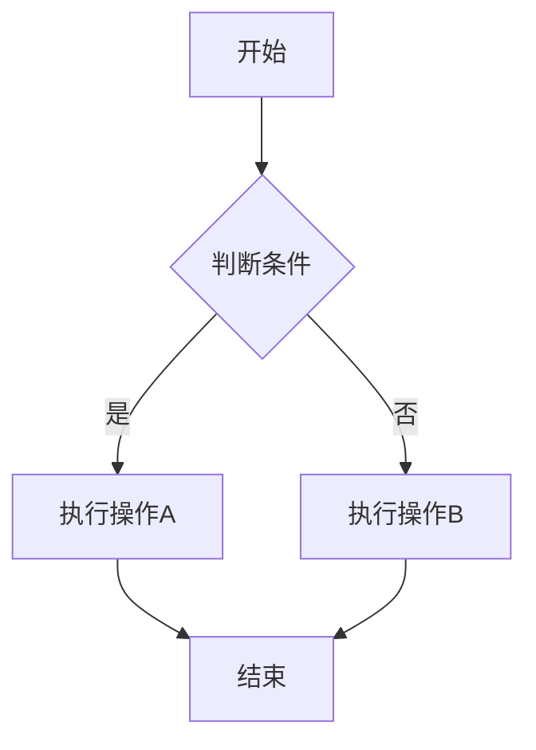

>这是一份用于测试 Markdown 渲染引擎的综合性文档，包含了大部分主流的 Markdown 语法特性。

## 6. 代码块

### JavaScript 代码
```javascript
function fibonacci(n) {
    if (n <= 1) return n;
    return fibonacci(n - 1) + fibonacci(n -  2); // 测试单行，很长很长很长很长很长很长很长很长很长很长
}

console.log(fibonacci(10)); // 输出: 55
```

### Python 代码
```python
def quick_sort(arr):
    if len(arr) <= 1:
        return arr
    pivot = arr[len(arr) // 2]
    left = [x for x in arr if x < pivot]
    middle = [x for x in arr if x == pivot]
    right = [x for x in arr if x > pivot]
    return quick_sort(left) + middle + quick_sort(right)
```

### 无语法高亮的代码块
```
这是一个无语法高亮的代码块
可以用来显示纯文本或配置文件
```


## 5. 表格

| 左对齐   | 居中对齐 | 右对齐 |
| :---- | :--: | --: |
| 数据1   | 数据2  | 数据3 |
| 较长的数据 | 中等数据 | 短数据 |
| A     |  B   |   C |

## AD TIP


> no title
```ad-tip
line 1
line 2

line 3
```

> with plain title
```ad-tip TITLE 1
line 1
line 2

line 3
```

> with json title
```ad-tip {TITLE: TITLE 2}
line 1
line 2

line 3
```


## 3. 列表

### 无序列表
- 项目 1
- 项目 2
  - 嵌套项目 2.1
  - 嵌套项目 2.2
    - 深层嵌套 2.2.1
- 项目 3

### 有序列表
1. 第一项
2. 第二项
   3. 嵌套项目 2.1
   4. 嵌套项目 2.2
5. 第三项

### 任务列表
- [x] 已完成任务
- [ ] 未完成任务
- [x] 另一个已完成任务


### JavaScript 代码
```javascript
function fibonacci(n) {
    if (n <= 1) return n;
    return fibonacci(n - 1) + fibonacci(n - 2);
}

console.log(fibonacci(10)); // 输出: 55
```


## 7. 引用

> 这是一个简单的引用。

> 这是一个多行引用。
> 它可以包含多个段落。
> 
> 甚至可以包含其他 Markdown 元素：
> 
> - 列表项
> - **粗体文本**
> - `代码`

### 嵌套引用
> 外层引用
> 
> > 内层引用
> > 
> > > 更深层的引用


## 11. 数学公式（如果支持 LaTeX）

行内公式：$E = mc^2$

块级公式：
$$
\int_{-\infty}^{\infty} e^{-x^2} dx = \sqrt{\pi}
$$

## 12. 流程图（Mermaid，如果支持）




## 1. 标题层级

# 一级标题
## 二级标题
### 三级标题
#### 四级标题
##### 五级标题
###### 六级标题

## 2. 文本格式

**粗体文本** 和 __另一种粗体__

*斜体文本* 和 _另一种斜体_

***粗斜体文本*** 和 ___另一种粗斜体___

~~删除线文本~~

==高亮文本==（如果支持）

`行内代码`


## 4. 链接和图片

[这是一个链接](https://www.example.com)

[带标题的链接](https://www.example.com "链接标题")


## 8. 水平分割线

---

***

___

## 9. 脚注

这里有一个脚注引用[^1]，还有另一个[^note]。

[^1]: 这是第一个脚注的内容。
[^note]: 这是一个有名称的脚注。

## 10. 定义列表（扩展语法）

术语1
:   定义1

术语2
:   定义2a
:   定义2b
## 13. 特殊字符和转义

这些字符需要转义：\* \_ \` \\ \# \+ \- \. \! \[ \] \( \) \{ \}

HTML 实体：&copy; &amp; &lt; &gt; &quot;

## 14. HTML 标签（如果支持）

<kbd>Ctrl</kbd> + <kbd>C</kbd>

<mark>高亮文本</mark>

<details>
<summary>点击展开详情</summary>
这里是隐藏的内容，只有点击上面的"点击展开详情"才会显示。
</details>

## 15. 换行测试

这一行后面有两个空格  
所以这里会换行

这一行没有空格
所以这里不会换行

## 16. 长文本测试

Lorem ipsum dolor sit amet, consectetur adipiscing elit. Sed do eiusmod tempor incididunt ut labore et dolore magna aliqua. Ut enim ad minim veniam, quis nostrud exercitation ullamco laboris nisi ut aliquip ex ea commodo consequat. Duis aute irure dolor in reprehenderit in voluptate velit esse cillum dolore eu fugiat nulla pariatur. Excepteur sint occaecat cupidatat non proident, sunt in culpa qui officia deserunt mollit anim id est laborum.

---

## 总结

这份文档涵盖了 Markdown 的主要语法特性，包括：

1. ✅ 标题层级（H1-H6）
2. ✅ 文本格式化（粗体、斜体、删除线等）
3. ✅ 列表（有序、无序、任务列表）
4. ✅ 链接和图片
5. ✅ 表格
6. ✅ 代码块和语法高亮
7. ✅ 引用和嵌套引用
8. ✅ 水平分割线
9. ✅ 脚注
10. ✅ 特殊字符处理
11. ✅ 扩展语法（如果支持）

通过这份文档，可以全面测试 Markdown 渲染引擎的兼容性和显示效果。